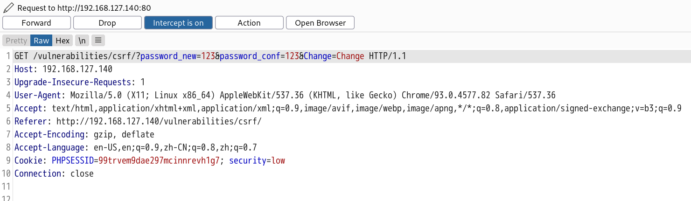
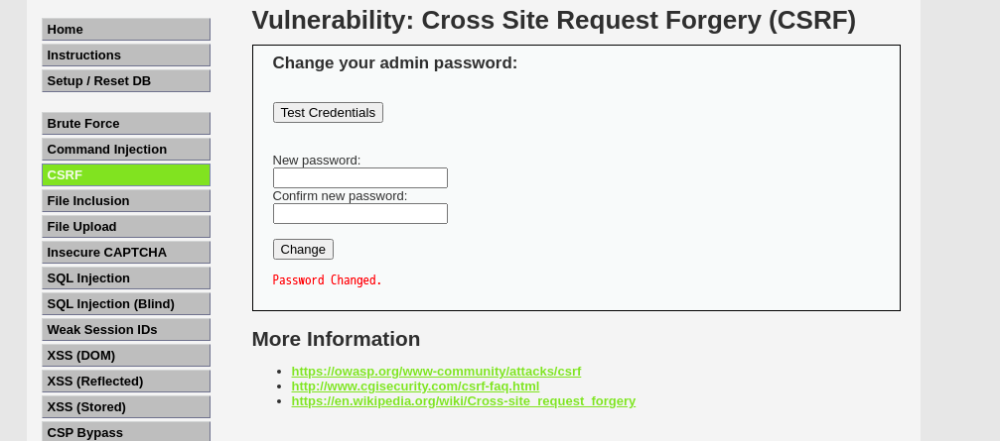
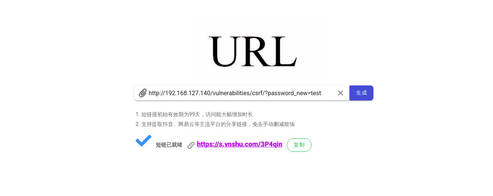
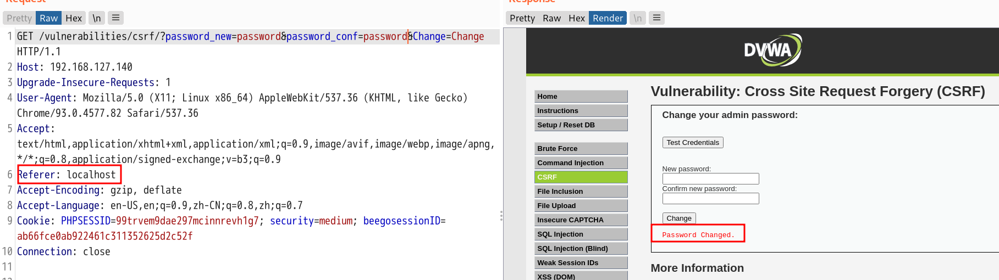

# CSRF漏洞

* [CSRF漏洞](#csrf漏洞)
  * [漏洞简介](#漏洞简介)
  * [漏洞原理](#漏洞原理)
  * [漏洞危害](#漏洞危害)
  * [漏洞测试](#漏洞测试)
    * [<strong>GET类型的CSRF的检测</strong>](#get类型的csrf的检测)
    * [<strong>POST类型的CSRF的检测</strong>](#post类型的csrf的检测)
    * [csrf与xss区别](#csrf与xss区别)
  * [漏洞复现](#漏洞复现)
    * [DVWA漏洞环境](#dvwa漏洞环境)
      * [LOW级别源码](#low级别源码)
      * [Medium级别源码](#medium级别源码)
      * [High级别源码](#high级别源码)
      * [Impossible级别源码](#impossible级别源码)
  * [漏洞修复](#漏洞修复)

------

## 漏洞简介

```php
 CSRF（Cross-site request forgery）跨站请求伪造：攻击者诱导受害者进入第三方网站，在第三方网站中，向被攻击网站发送跨站请求。利用受害者在被攻击网站已经获取的注册凭证，绕过后台的用户验证，达到冒充用户对被攻击的网站执行某项操作的目的
```

------

## 漏洞原理

```php
1.用户C打开浏览器，访问受信任网站A，输入用户名和密码请求登录网站A；

2.在用户信息用过验证后，网站A产生Cookie信息并返回给浏览器，此时用户登录网站A成功，可以正常发送请求到网站A；

3.用户未退出网站A之前，在同一浏览器中打开一个TAB页访问网站B；

4.网站B接受到用户请求后，返回一些攻击性代码，并发出一个请求要求访问第三方站点A；

5.浏览器在接收到这些攻击性代码后，根据网站B的请求，在用户不知情的情况下携带Cookie信息，向网站A发出请求。网站A并不知道该请求其实是由B发起的，所以会根据用户C的Cookie信息以C的权限处理该请求，导致来自网站B的恶意代码被执行。
```

------

## 漏洞危害

```php
攻击者可以让受害者用户修改任何允许修改的数据，执行任何用户允许的操作，例如修改密码，登录注销等
```

------

## 漏洞测试

### **GET类型的CSRF的检测**

```php
如果有token等验证参数，先去掉参数尝试能否正常请求。如果可以，即存在CSRF漏洞
```

### **POST类型的CSRF的检测**

```php
如果有token等验证参数，先去掉参数尝试能否正常请求。如果可以，再去掉referer参数的内容，如果仍然可以，说明存在CSRF漏洞，可以利用构造外部form表单的形式，实现攻击。如果直接去掉referer参数请求失败，这种还可以继续验证对referer的判断是否严格，是否可以绕过
```

### csrf与xss区别

````php
XSS：跨站脚本（Cross-site scripting，通常简称为XSS）是一种网站应用程序的安全漏洞攻击，是代码注入的一种。它允许恶意用户将代码注入到网页上，其他用户在观看网页时就会受到影响。这类攻击通常包含了HTML以及客户端脚本语言（最常见如：JavaScript）

XSS更偏向于方法论，CSRF更偏向于一种形式，只要是伪造用户发起的请求，都可成为CSRF攻击。

通常来说CSRF是由XSS实现的，所以CSRF时常也被称为XSRF[用XSS的方式实现伪造请求]（但实现的方式绝不止一种，还可以直接通过命令行模式（命令行敲命令来发起请求）直接伪造请求[只要通过合法验证即可]）。

XSS更偏向于代码实现（即写一段拥有跨站请求功能的JavaScript脚本注入到一条帖子里，然后有用户访问了这个帖子，这就算是中了XSS攻击了），CSRF更偏向于一个攻击结果，只要发起了冒牌请求那么就算是CSRF了
````


------

## 漏洞复现

### DVWA漏洞环境

#### LOW级别源码

```php
<?php

if( isset( $_GET[ 'Change' ] ) ) {
    // Get input
    $pass_new  = $_GET[ 'password_new' ];
    $pass_conf = $_GET[ 'password_conf' ];

    // Do the passwords match?
    if( $pass_new == $pass_conf ) {
        // They do!
        $pass_new = ((isset($GLOBALS["___mysqli_ston"]) && is_object($GLOBALS["___mysqli_ston"])) ? mysqli_real_escape_string($GLOBALS["___mysqli_ston"],  $pass_new ) : ((trigger_error("[MySQLConverterToo] Fix the mysql_escape_string() call! This code does not work.", E_USER_ERROR)) ? "" : ""));
        $pass_new = md5( $pass_new );

        // Update the database
        $insert = "UPDATE `users` SET password = '$pass_new' WHERE user = '" . dvwaCurrentUser() . "';";
        $result = mysqli_query($GLOBALS["___mysqli_ston"],  $insert ) or die( '<pre>' . ((is_object($GLOBALS["___mysqli_ston"])) ? mysqli_error($GLOBALS["___mysqli_ston"]) : (($___mysqli_res = mysqli_connect_error()) ? $___mysqli_res : false)) . '</pre>' );

        // Feedback for the user
        echo "<pre>Password Changed.</pre>";
    }
    else {
        // Issue with passwords matching
        echo "<pre>Passwords did not match.</pre>";
    }

    ((is_null($___mysqli_res = mysqli_close($GLOBALS["___mysqli_ston"]))) ? false : $___mysqli_res);
}

?>

```

 通过GET方式获取密码，两次密码一致的话，然后直接代入数据中修改密码。属于最基础的GET型CSRF。

可以看到，源码中的mysql_real_escape_string() 函数有防护sql注入的作用，然后就只进行了$pass_new == $pass_conf判断，没有进行任何的验证。

填入新密码和确认密码，用burpsuite抓取数据包



根据上面的Url地址来构造一个修改密码的Payload：

http://192.168.127.140/vulnerabilities/csrf/?password_new=test&password_conf=test&Change=Change



现在password已经从password密码变更为test密码

为了更好的隐藏还可以通过短地址转换网站(https://tools.vnshu.com/shortUrl)将url缩短




#### Medium级别源码

```php
<?php

if( isset( $_GET[ 'Change' ] ) ) {
    // Checks to see where the request came from
    if( stripos( $_SERVER[ 'HTTP_REFERER' ] ,$_SERVER[ 'SERVER_NAME' ]) !== false ) {
        // Get input
        $pass_new  = $_GET[ 'password_new' ];
        $pass_conf = $_GET[ 'password_conf' ];

        // Do the passwords match?
        if( $pass_new == $pass_conf ) {
            // They do!
            $pass_new = ((isset($GLOBALS["___mysqli_ston"]) && is_object($GLOBALS["___mysqli_ston"])) ? mysqli_real_escape_string($GLOBALS["___mysqli_ston"],  $pass_new ) : ((trigger_error("[MySQLConverterToo] Fix the mysql_escape_string() call! This code does not work.", E_USER_ERROR)) ? "" : ""));
            $pass_new = md5( $pass_new );

            // Update the database
            $insert = "UPDATE `users` SET password = '$pass_new' WHERE user = '" . dvwaCurrentUser() . "';";
            $result = mysqli_query($GLOBALS["___mysqli_ston"],  $insert ) or die( '<pre>' . ((is_object($GLOBALS["___mysqli_ston"])) ? mysqli_error($GLOBALS["___mysqli_ston"]) : (($___mysqli_res = mysqli_connect_error()) ? $___mysqli_res : false)) . '</pre>' );

            // Feedback for the user
            echo "<pre>Password Changed.</pre>";
        }
        else {
            // Issue with passwords matching
            echo "<pre>Passwords did not match.</pre>";
        }
    }
    else {
        // Didn't come from a trusted source
        echo "<pre>That request didn't look correct.</pre>";
    }

    ((is_null($___mysqli_res = mysqli_close($GLOBALS["___mysqli_ston"]))) ? false : $___mysqli_res);
}

?>
```

 if( stripos( $_SERVER[ 'HTTP_REFERER' ] ,$_SERVER[ 'SERVER_NAME' ]) !== false )

 增加了Referer判断，若HTTP_REFERER和SERVER_NAME不是来自同一个域的话就无法进行到代码内部，执行修改密码的操作，可以伪造Referer来进行攻击

用Burpsuite抓取修改密码的数据包


将Referer值修改为localhost即可绕过




#### High级别源码

```php
<?php

$change = false;
$request_type = "html";
$return_message = "Request Failed";

if ($_SERVER['CONTENT_TYPE'] == "application/json") {
    $data = json_decode(file_get_contents('php://input'), true);
    $request_type = "json";
    if (array_key_exists("HTTP_USER_TOKEN", $_SERVER) &&
        array_key_exists("password_new", $data) &&
        array_key_exists("password_conf", $data) &&
        array_key_exists("Change", $data)) {
        $token = $_SERVER['HTTP_USER_TOKEN'];
        $pass_new = $data["password_new"];
        $pass_conf = $data["password_conf"];
        $change = true;
    }
} else {
    if (array_key_exists("user_token", $_REQUEST) &&
        array_key_exists("password_new", $_REQUEST) &&
        array_key_exists("password_conf", $_REQUEST) &&
        array_key_exists("Change", $_REQUEST)) {
        $token = $_REQUEST["user_token"];
        $pass_new = $_REQUEST["password_new"];
        $pass_conf = $_REQUEST["password_conf"];
        $change = true;
    }
}

if ($change) {
    // Check Anti-CSRF token
    checkToken( $token, $_SESSION[ 'session_token' ], 'index.php' );

    // Do the passwords match?
    if( $pass_new == $pass_conf ) {
        // They do!
        $pass_new = mysqli_real_escape_string ($GLOBALS["___mysqli_ston"], $pass_new);
        $pass_new = md5( $pass_new );

        // Update the database
        $insert = "UPDATE `users` SET password = '" . $pass_new . "' WHERE user = '" . dvwaCurrentUser() . "';";
        $result = mysqli_query($GLOBALS["___mysqli_ston"],  $insert );

        // Feedback for the user
        $return_message = "Password Changed.";
    }
    else {
        // Issue with passwords matching
        $return_message = "Passwords did not match.";
    }

    mysqli_close($GLOBALS["___mysqli_ston"]);

    if ($request_type == "json") {
        generateSessionToken();
        header ("Content-Type: application/json");
        print json_encode (array("Message" =>$return_message));
        exit;
    } else {
        echo "<pre>" . $return_message . "</pre>";
    }
}

// Generate Anti-CSRF token
generateSessionToken();

?>

```

 High级别的代码加入了Anti-CSRF token机制，用户每次访问改密页面时，服务器都会返回一个随机的token，当浏览器向服务器发起请求时，需要提交token参数，而服务器在收到请求时，会优先检查token，只有token正确，才会处理客户端的请求。

在这里，我们要想获取到用户的token,并提交修改密码的表单的话，就必须得把我们的攻击脚本注入到目标服务器中 。而要想注入到目标服务器，同时得发挥作用，获取用户的 token修改密码的话，就得和XSS漏洞一起结合实现了。

我们将如下代码通过存储型XSS插入到数据库中，这语句会弹出用户的token

```php
<iframe src="../csrf/" onload=alert(frames[0].document.getElementsByName('user_token')[0].value)></iframe>
```

获取到token后就可以利用medium中的方法进行攻击。


#### Impossible级别源码

```php
<?php

if( isset( $_GET[ 'Change' ] ) ) {
    // Check Anti-CSRF token
    checkToken( $_REQUEST[ 'user_token' ], $_SESSION[ 'session_token' ], 'index.php' );

    // Get input
    $pass_curr = $_GET[ 'password_current' ];
    $pass_new  = $_GET[ 'password_new' ];
    $pass_conf = $_GET[ 'password_conf' ];

    // Sanitise current password input
    $pass_curr = stripslashes( $pass_curr );
    $pass_curr = ((isset($GLOBALS["___mysqli_ston"]) && is_object($GLOBALS["___mysqli_ston"])) ? mysqli_real_escape_string($GLOBALS["___mysqli_ston"],  $pass_curr ) : ((trigger_error("[MySQLConverterToo] Fix the mysql_escape_string() call! This code does not work.", E_USER_ERROR)) ? "" : ""));
    $pass_curr = md5( $pass_curr );

    // Check that the current password is correct
    $data = $db->prepare( 'SELECT password FROM users WHERE user = (:user) AND password = (:password) LIMIT 1;' );
    $data->bindParam( ':user', dvwaCurrentUser(), PDO::PARAM_STR );
    $data->bindParam( ':password', $pass_curr, PDO::PARAM_STR );
    $data->execute();

    // Do both new passwords match and does the current password match the user?
    if( ( $pass_new == $pass_conf ) && ( $data->rowCount() == 1 ) ) {
        // It does!
        $pass_new = stripslashes( $pass_new );
        $pass_new = ((isset($GLOBALS["___mysqli_ston"]) && is_object($GLOBALS["___mysqli_ston"])) ? mysqli_real_escape_string($GLOBALS["___mysqli_ston"],  $pass_new ) : ((trigger_error("[MySQLConverterToo] Fix the mysql_escape_string() call! This code does not work.", E_USER_ERROR)) ? "" : ""));
        $pass_new = md5( $pass_new );

        // Update database with new password
        $data = $db->prepare( 'UPDATE users SET password = (:password) WHERE user = (:user);' );
        $data->bindParam( ':password', $pass_new, PDO::PARAM_STR );
        $data->bindParam( ':user', dvwaCurrentUser(), PDO::PARAM_STR );
        $data->execute();

        // Feedback for the user
        echo "<pre>Password Changed.</pre>";
    }
    else {
        // Issue with passwords matching
        echo "<pre>Passwords did not match or current password incorrect.</pre>";
    }
}

// Generate Anti-CSRF token
generateSessionToken();

?>

```

impossible级别修改密码需要输入之前的密码，黑客无法知道用户之前的密码，所以无法进行CSRF攻击。

------

## 漏洞修复

* **添加验证码**：在一些特殊请求页面增加验证码，验证码强制用户必须与应用进行交互，才能完成最终请求

* **检测refer**：检测refer值，来判断请求来源是否合法。

* **Token**：在每个请求中设置Token是一种流行的方式来防御CSRF。CSRF攻击的原理：攻击者可以猜测到用户请求，现在在每个请求中加一个随机的Toekn值。

  Token要足够随机————只有这样才算不可预测

  Token是一次性的，即每次请求成功后要更新Token————这样可以增加攻击难度，增加预测难度

  Token要注意保密性————敏感操作使用post，防止Token出现在URL中

